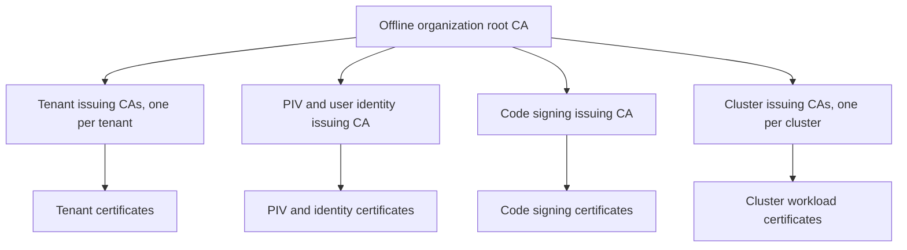
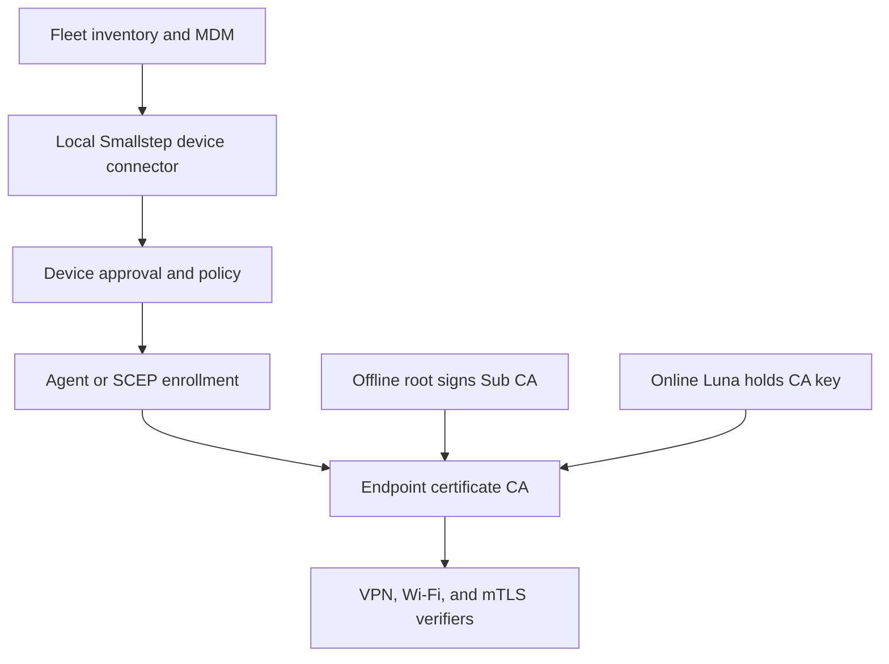

# Airgapped PKI production reference architecture and operations

**Status:** Consultation draft; production reference architecture with release-specific acceptance gates  
**Audience:** PKI, HSM, platform, identity, compliance, and security operations teams  
**Last reviewed:** September 2026  
**Scope:** Disconnected internal infrastructure using Step CA Pro, Thales SafeNet Luna Network HSM, Kubernetes, ACME, SCEP, SPIFFE/SPIRE, FIPS-approved cryptography, and a PQC transition

This architecture defines the trust boundaries, production controls, enrollment paths, operations, and acceptance criteria for a disconnected enterprise PKI. It uses **Thales SafeNet Luna Network HSM** as the proposed HSM family; the exact appliance, firmware, client, and FIPS mode require confirmation. The target is FIPS operation with a controlled path to post-quantum algorithms; neither property follows automatically from enabling an HSM or buying Step CA Pro. Product release, cryptographic module boundary, and client interoperability must be recorded in the deployment evidence. Values in angle brackets are deployment-specific. The examples are patterns, not a completed environment configuration.

## Design decisions and open approvals

| Decision | Proposed baseline | Approval needed before rollout |
| --- | --- | --- |
| Root | One organization root with a proposed 20-year certificate; its key stays offline and signs issuing Sub CA certificates and root CRLs during controlled ceremonies | Trust domain, legal tenant isolation, root ceremony and exact dates |
| Issuing Sub CAs | Online Step CA Pro authorities with a proposed 10-year certificate each; these issue and renew end-entity certificates from Kubernetes | Actual count, Pro license and management model |
| Tenant separation | Dedicated CA service, database, policy, admin scope, and HSM key or partition per tenant | Whether some tenants require independent roots |
| PIV and user identity | Dedicated RSA issuing CA; enrollment gated by approved identity and device workflow | Windows mapping requirements, approved EKUs, client revocation behavior |
| Code signing | Dedicated issuing CA and approval workflow; signing keys protected at the signer | Timestamp authority, artifact signing policy, CRL/OCSP requirements |
| Kubernetes | Dedicated issuing CA per cluster; cert-manager uses ACME for supported DNS names | Cluster naming, DNS solver, account registration |
| Networking | CA endpoints internal only; separate enrollment, admin, HSM, database, and CRL paths | Firewall matrix, DNS and load balancer owners |
| High availability | Two or more CA replicas per authority, external PostgreSQL, redundant HSM partitions | Supported Pro topology, tested client and DB versions |
| Disconnected operation | All images, packages, license material, and updates staged through the approved transfer process | Vendor confirmation of offline activation and feature availability |
| FIPS | All cryptographic operations in scope use validated modules in approved modes | CMVP certificates, security policies, build evidence, and assessment boundary |
| Post-quantum readiness | Classical production trust with separate, gated ML-KEM and ML-DSA pilots | CA, HSM, client, signature, and FIPS interoperability test results |
| SPIFFE workload identity | SPIRE per cluster or bounded trust domain; X.509-SVID via Workload API | Approved topology, FIPS evidence, identity policy, bundle management |
| Smallstep SSH | Separate SSH user and host CA keys and provisioning policies for infrastructure access | SSH product/license, host fleet scope, FIPS algorithms, revocation distribution |
| Smallstep Agent | Endpoint device lifecycle only if a fully disconnected management plane is licensed and supported | Run Anywhere platform, local attestation/control endpoints, offline updates |

**Product validation gate:** Obtain written confirmation from Smallstep for the exact Step CA Pro build, air-gapped licensing, image distribution, HSM PKCS #11 integration, active revocation or OCSP capabilities, audit export, and the supported model for many independent authorities. Public documentation describes Step CA Pro capabilities at a high level, but is not a substitute for the licensed deployment guide. [Smallstep platform overview](https://smallstep.com/docs/platform/) and [cryptographic protection](https://smallstep.com/docs/step-ca/cryptographic-protection/).

### Architecture outcome and deployment units

| Unit | Placement and dependency | Failure boundary |
| --- | --- | --- |
| Root signing environment | Offline workstation plus offline Luna root partition; separate custodians and recovery media | No online leaf issuance depends on root availability |
| PKI management cluster | Dedicated, redundant platform services with internal registry, DNS, time, secret delivery, and observability | Management plane stays available when a workload cluster fails |
| Online issuing authority | One Step CA Pro deployment per tenant/purpose/cluster, backed by PostgreSQL and an assigned Luna key/partition | Isolation of policies, credentials, signing keys, and audit |
| Enrollment edge | Private ACME and SCEP ingress, separate administrative ingress, and highly available CRL/OCSP publication | Clients can renew and validate without administrative access |
| SPIRE deployment | Server and datastore per trust domain; agents per Kubernetes node; Workload API local to workloads | Workload identity rotates independently of ACME service TLS |
| SSH CA service | Dedicated authority with distinct SSH user and host HSM keys | OpenSSH verifies SSH CA public keys, separate from X.509 trust |
| Endpoint device manager | Optional Smallstep Agent plus locally hosted platform dependencies | No Internet dependency for bootstrap, renewal, or device revocation |
| Regional dependencies | Prefer HSM, DB, CA, and publication endpoints in each region; test cross-region recovery | A WAN partition must not silently block every cluster's renewal |

For a multisite deployment, apply this pattern independently in Region A, Region B, and Region C as applicable. Assign each authority a primary region and an explicit recovery region. Where a tenant spans sites, choose either one regional issuer with tested WAN continuity or site-specific issuers under the same approved trust root; record the decision per tenant. Replicate only through vendor-supported HSM and database methods. This architecture does not assume synchronous Luna HA across long-haul links.

## CA hierarchy and trust boundaries



Each box under the root is a distinct **online issuing Sub CA**, also called an issuing intermediate. During a root ceremony, the offline root signs that Sub CA's CSR once; the online Sub CA then uses its own HSM key to issue, renew, and revoke leaf certificates without contacting the root for every request. The root also returns online on its approved schedule to sign replacement Sub CAs and publish root revocation information. A provisioner is an enrollment method on a CA; adding provisioners to a shared CA does **not** give it separate signing keys or tenant cryptographic isolation. The reference design runs each Sub CA as a separate authority deployment, with its own root-signed CA certificate, PKCS #11 key reference, service identity, database or isolated database/schema as supported, URL, policies, audit stream, and change ownership. Open-source `step-ca` is documented around a single configured intermediate; do not infer multi-intermediate routing from provisioner features. [Smallstep open source comparison](https://smallstep.com/open-source/) and [CA production considerations](https://smallstep.com/docs/step-ca/certificate-authority-server-production/).

If a tenant requires a separate trust anchor, compliance boundary, or independence when another tenant's issuing CA is compromised, give that tenant a separate root hierarchy. Sharing a root means every client trusting that root can build a valid chain from every subordinate; application-level name checks and EKUs remain mandatory. A dedicated intermediate narrows signing-key exposure but does not automatically constrain what a relying party trusts.

**Certificate constraints for all issuing Sub CAs:** `basicConstraints CA:TRUE, pathLenConstraint:0`; `keyUsage keyCertSign,cRLSign`; unique subject and SKI; AKI pointing to the root; appropriate CDP/AIA where clients require them. These Sub CAs sign **end-entity** certificates, not another subordinate CA. Set a Sub CA's expiration no later than the root's, with enough operational margin for migration. Use name constraints only after testing every relevant client and application. The offline root has `CA:TRUE`, `keyCertSign,cRLSign`, and the proposed 20-year lifetime. Never mount or distribute its private key in Kubernetes.

At the root ceremony, decide and record its **path length constraint**. A maximum of one intermediate supports the standard Step CA Pro branches; the optional corporate-root-anchored SPIRE branch requires at least two intermediate levels. This property is embedded in the root certificate and cannot be expanded later by changing a Kubernetes setting. Limit any additional CA depth to the SPIFFE bridge issuance workflow and test that normal Sub CAs cannot sign another CA.

### Validity and planned overlap

Set the root certificate validity to **20 years** at its initial ceremony. Set each first-generation online Sub CA to **10 years**. Replace each Sub CA with a **new HSM key and a newly root-signed 10-year certificate** before its current certificate expires. This is key rotation, not an extension of the same certificate. A replacement signed by the original root must expire on or before that root. Smallstep's intermediate rotation guidance explicitly calls for this expiry bound and describes how previously issued leaf chains remain valid during migration. [Smallstep rotating an intermediate CA](https://smallstep.com/docs/step-ca/certificate-authority-server-production/#rotating-an-intermediate-ca).

| Relative time | Planned activity | Trust and issuance state |
| --- | --- | --- |
| Year 0 | Offline root ceremony; issue the first Sub CAs for 10 years | Root trusted; generation 1 Sub CAs issue leaves online |
| Years 8–9 | Generate new online HSM keys; bring root online under quorum to sign generation 2 Sub CAs | Move new issuance to generation 2; keep generation 1 chains and revocation available until all its leaves expire |
| Years 16–17 | Begin **new root** ceremony and distribute the new trust anchor before the original root expires | Migrate issuance to Sub CAs under the new root; allow an approved dual-trust interval |
| Before year 20 | Finish migration and retire the old root under policy | No newly issued certificate depends on an expired root |

The years 8–9 and 16–17 are **planning targets**, not exact issuance dates: use recorded `notAfter` values and sufficient margin for your longest leaf validity, particularly PIV and code signing. If generation 2 is issued in year 9 with a 10-year life, it expires in year 19; a late replacement may need a shorter validity to stay within the original root's lifetime. Enforce `leaf notAfter ≤ issuing Sub CA notAfter` in templates or issuance policy, and schedule migrations before any old leaf or CRL becomes unusable. The 20-year root must itself be replaced early enough to distribute the new root and reissue dependent chains; rotating the Sub CA once does not remove the need for a root transition.

Suggested naming examples:

| Authority | Internal DNS name | HSM partition or HA group | Permitted identity space |
| --- | --- | --- | --- |
| Tenant A | `ca-tenant-a.pki.<domain>` | `pki-tenant-a` | `*.tenant-a.<domain>` and approved tenant URI space |
| PIV identity | `ca-identity.pki.<domain>` | `pki-identity` | Directory identities and approved device IDs |
| Code signing | `ca-signing.pki.<domain>` | `pki-signing` | Named signing identities and services |
| Cluster A | `ca-cluster-a.pki.<domain>` | `pki-cluster-a` | Approved cluster A workload DNS/URI space |

The `<domain>` label must be a domain controlled by the organization; do not use the examples literally. A cluster CA can live in a shared, dedicated PKI Kubernetes cluster to survive loss of its client cluster. Do not put a cluster's only CA, only database, only DNS resolver, and only HSM path inside that same cluster.

## Certificate profiles

| Profile | CA and enrollment | Recommended initial validity | Critical profile checks |
| --- | --- | --- | --- |
| Workload TLS | Cluster CA, ACME or approved workload attestation | 24 h to 7 d, depending on renewal reliability | `serverAuth` and/or `clientAuth`; permitted DNS/URI SANs; no arbitrary IP SAN |
| Tenant service TLS | Tenant CA, ACME with scoped accounts | 24 h to 7 d | Tenant DNS names, EAB when supported, DNS challenge ownership |
| PIV authentication | Identity CA, approved RA; SCEP only if client workflow requires it | Set from card lifecycle and revocation SLA | `clientAuth` plus application-specific smart-card EKUs/SAN mapping; non-exportable card key and PIN |
| User mTLS | Identity CA, SSO or approved RA | Hours to 1 d when fully automated | Directory identity in subject/SAN, deprovisioning and renewal policy |
| Code signing | Signing CA, workflow-controlled CSR | Months to years per verifier and timestamp policy | `codeSigning` only; signer key custody; timestamp verification and revocation |
| Network device | Appropriate tenant or infrastructure CA, SCEP | Fit device renewal support | Device identity, approved SAN, challenge binding, RSA/client compatibility |

These lifetimes are **starting policy proposals**. Finalize against renewal testing, offline operations, client behavior, and the organization's certificate policy. For code signing, decide how signatures made before revocation remain verifiable and whether an internal trusted timestamp authority is required. For PIV, confirm the application or Windows logon trust and identity mapping explicitly: a PIV certificate by itself does not create a Windows account or make a non-AD Kerberos domain behave like AD.

**Separation:** Do not issue a leaf with both `codeSigning` and `clientAuth`. Do not use the issuing CA's HSM signing key as the end user's PIV key or the build service's code signing key. A root or intermediate certificate is never an enrollment credential.

### Certificate and CRL profile catalog

The [DoD NIPRNet Certificate and CRL Profiles, v6.0 (June 2025)](https://dl.dod.cyber.mil/wp-content/uploads/pki-pke/pdf/unclass-dod_pki_nipr_cert_profiles.pdf) provides a useful **specification format**: a separate table for each certificate purpose, with subject, issuer, validity, public-key algorithm, extension criticality, permitted and prohibited values, and status-publication rules. The following profiles are **proposed private-PKI templates**, not DoD certificates, DoD interoperability claims, or automatic adoption of DoD certificate-policy OIDs, distinguished names, Federal PIV identifiers, UPNs, legacy RSA-2048 periods, or prescribed validity. Approve each profile under the organization's own certificate policy and practice statement (CP/CPS). Each row is a separate allowlisted issuance path, provisioner or RA decision, and negative test; vendor and relying-party support are release-specific.

**Common X.509 v3 rules for every profile:** Use a unique positive serial per issuer, RFC 5280-conformant encoding and time, a fixed issuer DN per CA generation, an SKI on the subject and AKI referencing the issuer where appropriate, and a verifiable full chain. Reject unknown critical extensions, `anyExtendedKeyUsage`, requester-selected policy OIDs, CA bits or path length on leaves, unapproved SAN types, unexpected KU/EKU combinations, and issuance beyond the issuer's `notAfter`. Criticality in the tables below is an **intended policy**: basicConstraints and keyUsage are critical for issuing CAs; keyUsage is critical for leaves; SAN is critical if the subject DN is empty, otherwise ordinarily noncritical. Keep EKU noncritical except where a protocol specifically requires otherwise (RFC 3161 TSA). Include only organization-owned policy OIDs registered in the CP/CPS and allowed by the issuing CA; an OID is an assertion of defined policy, not a decorative identifier. Do not copy DoD or Federal PKI OIDs. [RFC 5280](https://datatracker.ietf.org/doc/rfc5280/).

| Profile ID | Subject and issuer / key purpose | Key and signature proposal | Validity and primary revocation |
| --- | --- | --- | --- |
| `CA-ROOT-01` | Self-signed offline organization root; signs approved issuing CAs and root CRLs | ECDSA P-384/SHA-384; RSA-4096/SHA-384 if verifier or HSM interoperability requires it | 20 years proposed; offline root CRL per approved freshness schedule |
| `CA-ISSUER-01` | Distinct issuer for each tenant, PIV/user, code signing, cluster, or endpoint device purpose | ECDSA P-384/SHA-384 where every client validates the chain; RSA-4096/SHA-384 alternative; SCEP-compatible RSA issuer only after FIPS gate | 10 years proposed, bounded by root; parent root CRL for issuer certificate |
| `TLS-SERVER-01` | Authorized DNS service on the owning tenant or cluster CA | ECDSA P-256/SHA-256 default where compatible; P-384/SHA-384 for stronger profile; RSA-3072/SHA-384 fallback after test | 24 h–7 d; client status check or short TTL and isolation |
| `TLS-CLIENT-01` | Inventory-bound workload, API client, or operator mTLS identity | ECDSA P-256/P-384; RSA-3072 only where required | Hours–1 d automated; issuer leaf CRL/OCSP for longer use |
| `PIV-AUTH-01` | Person-bound PIV authentication key generated on card | P-256/SHA-256 or P-384/SHA-384 when card, middleware, KDC and application support it; RSA-3072 after testing | Per card policy and revocation SLA; active CRL/OCSP |
| `PIV-SIGN-01` | Separate on-card personal document/signature key | P-256/P-384 signing profile; RSA-3072 if required by verifier | Per card policy; active CRL/OCSP and signed-document validation |
| `PIV-KM-01` | Separate on-card encryption or key-management identity, only if needed | Approved P-256/P-384 ECDH or RSA-3072 key transport according to client and approved-module support | Per card and archival recovery policy; active CRL/OCSP |
| `DEVICE-01` | Fleet/MDM device certificate or short-lived bootstrap credential, scoped to device inventory | P-256/P-384 for agent attestation flows; SCEP RSA size and CMS path separately qualified | Bootstrap minutes–hours if feasible; device certificate days–weeks; issuer leaf status |
| `CODE-SIGN-01` | Approved signer service, release identity, or hardware token | P-384/SHA-384 where artifact verifier supports it; RSA-3072/4096/SHA-384 for verified legacy tooling | Months–1 year proposal; active revocation plus timestamp/archival policy |
| `OCSP-01` / `TSA-01` | Dedicated responder / timestamp signer if those services are deployed | P-256/P-384 or RSA-3072 as verifier requires; separate key and service roles | Short responder lifetime and rotation / TSA lifetime per retention policy |

The algorithms above are **policy candidates**, not an assertion that every client or validated crypto module supports every option. ECDSA P-256 is a practical interoperable default for many short-lived TLS leaves; P-384 provides a higher classical security strength for long-lived CA and high-assurance signing keys. Keep FIPS signing and verification within the recorded module boundaries. Do not use Ed25519, X25519, ML-DSA, or a hybrid TLS group in the approved production profile without an explicit validation and interoperability decision. For PIV, select card and middleware algorithms against [NIST SP 800-78-5](https://csrc.nist.gov/pubs/sp/800/78/5/final); a P-384-capable CA does not make a card or Windows logon path P-384-capable. Validate RSA-PSS, ECDSA, PKCS #11 mechanisms, Windows tooling, code verifiers, SCEP CMS, and HSM firmware **per profile**, and record a fallback only where it remains acceptable in FIPS mode. [NIST SP 800-131A Rev. 2](https://csrc.nist.gov/pubs/sp/800/131/a/r2/final).

| Profile family | Required / forbidden extensions and identity mapping | Distribution and verifier test |
| --- | --- | --- |
| Root CA | `basicConstraints` critical `CA:TRUE`, path length set at ceremony; `keyUsage` critical `keyCertSign,cRLSign`; SKI; self-signed issuer/subject DN; **no leaf EKU**, no DNS SAN | Pin fingerprint out of band; publish root certificate and signed root CRL. A root certificate's CDP is not a substitute for trust-anchor management |
| Issuing Sub CA | `basicConstraints` critical `CA:TRUE,pathLen:0`; `keyUsage` critical `keyCertSign,cRLSign`; SKI and root AKI; unique DN/key per generation; EKU absent unless a constrained CA design and all verifiers support it | `caIssuers` AIA points to parent chain as needed; CDP/OCSP on **intermediate** names the root-operated issuer-status service, not the subordinate's leaf CRL. Check chain, path length, policy and name constraints where deployed |
| TLS server | `basicConstraints CA:FALSE`; critical KU `digitalSignature` for ECDSA and modern TLS signature use; EKU `serverAuth` **only**; DNS SAN from approved DNS inventory, IP SAN only by exception; no reliance on CN matching | Leaf AIA/CDP points to this issuing CA's chain and status service; test DNS matching, KU/EKU, unknown SAN rejection, renewal and live-server reload. If an RSA key-exchange use case exists, assess `keyEncipherment` separately rather than enabling it universally |
| TLS client | `CA:FALSE`; critical KU `digitalSignature`; EKU `clientAuth` only; immutable inventory-bound URI or other application-recognized SAN; no caller-chosen role or tenant field | Verifier maps SAN to current identity **and** action authorization; check leaf revocation if TTL exceeds effective response goal |
| PIV authentication | `CA:FALSE`; critical KU `digitalSignature`; EKU `clientAuth` with `smartCardLogon` and/or PKINIT client EKU **only if required by a tested Windows/Kerberos path**; SAN mapped to managed user ID, with UPN/PKINIT otherName only if correctly encoded and required | CRL/OCSP reachable from smart-card relying parties; verify PIN, token key origin, account mapping, disable/revoke flow. Avoid copying DoD FASC-N or policy OIDs |
| PIV signature / key management | Signature: `digitalSignature` (and `contentCommitment` only if policy needs it), separate key, EKU appropriate to actual document or S/MIME verifier. Encryption: `keyAgreement` for ECDH or `keyEncipherment` for supported RSA key transport; never reuse authentication key for escrow | Verify signature purpose and archival evidence; determine recovery/escrow **only** for encryption keys where required, never for authentication or signature keys |
| Fleet/MDM device | `CA:FALSE`; KU/EKU **per use** (`clientAuth` for EAP-TLS/VPN, `serverAuth` only for an independently approved host use); SAN bound to device identifier and policy, no self-asserted owner | Record whether SCEP certificate is a bootstrap credential or final identity; test MDM renewal, HSM SCEP decrypt, CRL/OCSP, loss and inventory delay |
| Code signing | `CA:FALSE`; critical KU `digitalSignature`; EKU `codeSigning` only; subject/optional SAN names approved signer, not caller-controlled artifact digest | Publish issuing chain and leaf status; verifier validates artifact digest, signer, timestamp and revocation at the policy-defined time. Do not add Microsoft's lifetime-signing OID without an explicit compatibility and retention decision |
| OCSP responder / TSA | Dedicated leaf `CA:FALSE`, KU `digitalSignature`; responder EKU `OCSPSigning` only; TSA EKU `timeStamping` **solely and critical** for RFC 3161 | Validate responder authorization by issuer and responder rotation; evaluate `id-pkix-ocsp-nocheck` carefully with short validity and key isolation. TSA needs a trusted time source and retention policy. These are optional services, not capabilities inferred from Step CA Pro |

**Additional PIV card-authentication profile (`PIV-CARD-01`) only if relying applications actually use it:** separate card key and identifier, verified token provenance, no person logon privilege inferred from card possession, and explicit KU/EKU mapping to the chosen card-authentication standard. The DoD PDF includes both PIV authentication and card authentication as distinct profiles; their OIDs and identity encodings are **not** a ready-made private enterprise specification. [DoD profiles](https://dl.dod.cyber.mil/wp-content/uploads/pki-pke/pdf/unclass-dod_pki_nipr_cert_profiles.pdf), [NIST SP 800-78-5](https://csrc.nist.gov/pubs/sp/800/78/5/final).

**SPIFFE and SSH are separate namespaces:** SPIRE issues `X509-SVID-01` from its own trust-domain bundle (or the approved bridge). Its URI SAN contains the SPIFFE ID and is critical if subject is empty; the leaf is not a general DNS/TLS-server, PIV, or code-signing certificate. The workload verifier checks bundle and precise SPIFFE ID. Smallstep SSH issues OpenSSH user/host certificates with principals, validity, and critical options, **not** X.509 KU/EKU/CDP; see the SSH section. [SPIFFE X.509-SVID](https://spiffe.io/docs/latest/spiffe-specs/x509-svid/).

**CRL profile `CRL-ROOT-01` / `CRL-LEAF-01`:** Signed full X.509 v2 CRL, unique monotonically increasing CRL number per issuer/key, issuer DN and AKI matched to the signing CA, valid `thisUpdate`/`nextUpdate`, and serial/revocation date/reason as supported. The offline root issues status for **intermediates**; every online issuer publishes status for **its own leaves**, including old serials during Sub CA replacement. Set a documented publication interval and overlap so redundant mirrors deliver fresh bytes before `nextUpdate`; test mirror latency and client fail behavior. Delta CRLs, indirect CRLs, and OCSP delegation require separately tested consumer support. DoD's CRL table illustrates the field-by-field specification; it does not set this deployment's cadence. [DoD CRL profile](https://dl.dod.cyber.mil/wp-content/uploads/pki-pke/pdf/unclass-dod_pki_nipr_cert_profiles.pdf), [RFC 5280](https://datatracker.ietf.org/doc/rfc5280/).

### Field specifications for each profile

These tables provide the **certificate-level detail** used in the DoD profile format. `C` means X.509 extension criticality (`Yes`, `No`, or `—` when not an extension). `Required`, `Optional`, and `Prohibited` are profile requirements. An optional field is **absent by default**, and can be enabled only in the named profile variant after testing. `G1` is an illustrative generation label; `O=<Organization>` and `<domain>` are placeholders, not actual DNs or URLs. `<issuer-id>` is an inventory-controlled identifier, not a requester-supplied value. If an exact name, organization-owned policy OID, URL, application otherName, or FIPS algorithm choice has not been approved, **do not issue that variant**. Values shown as proposed validity limits are design choices for consultation and must be ratified in the CP/CPS; `notAfter` also must not exceed the signing CA's `notAfter`.

The `PIV-*` entries cover a private smart-card deployment unless a separate project explicitly commits to **FIPS 201-conformant PIV** and its card data, standardized OIDs, issuer policies, privacy constraints, and relying-party requirements. A PIV-compatible token or PIV slot does not by itself create a Federal PIV credential. Standardized NIST PIV EKUs can still be used in a tested profile where the application genuinely requires their semantics; DoD certificate-policy OIDs and organizational names must never be copied merely because the DoD PDF uses them. [FIPS 201-3 PIV OIDs](https://pages.nist.gov/FIPS201/oid/) and [FIPS 201-3 cardholder authentication](https://pages.nist.gov/FIPS201/authentication/).

**Shared field encoding for all X.509 certificates:** version v3 (integer `2`); issuer name equals the actual signing certificate's subject DN with the same encoding; a nonnegative, unique serial no longer than 20 octets under RFC 5280; `notBefore`/`notAfter` in UTC with RFC 5280 time encoding; SPKI generated or validated against the named profile; signature algorithm and parameters match the actual HSM signing operation. Use a new serial on every renewal. Names are assigned by the RA from authoritative inventory, directory, or CA generation records, never copied unchecked from a CSR. For every non-self-signed cert, noncritical AKI contains the issuer's SKI (keyIdentifier form), and noncritical SKI contains a stable identifier of the subject public key. The policy below prohibits unlisted extensions, and requires inspection of the actual DER because template syntax and server defaults can differ. [RFC 5280](https://datatracker.ietf.org/doc/rfc5280/).

| Extension or access method | OID | Required encoding / control |
| --- | --- | --- |
| Subject key identifier / authority key identifier | `2.5.29.14` / `2.5.29.35` | Noncritical OCTET STRING key identifiers; check issuer match |
| Key usage / extended key usage | `2.5.29.15` / `2.5.29.37` | Critical BIT STRING KU; purpose OID SEQUENCE in EKU with per-profile criticality |
| Basic constraints / subject alternative name | `2.5.29.19` / `2.5.29.17` | Explicit CA flag and permitted path length; SAN DNS/URI/email names encoded as the correct IA5String `GeneralName`, IP as address octets |
| Certificate policies / name constraints | `2.5.29.32` / `2.5.29.30` | Registered organization OID only; name constraints critical when used on a Sub CA |
| Authority information access / CRL distribution points | `1.3.6.1.5.5.7.1.1` / `2.5.29.31` | AIA `caIssuers` access method `1.3.6.1.5.5.7.48.2`; OCSP access method `1.3.6.1.5.5.7.48.1` only if served; CDP URL resolves to the **certificate issuer's** CRL |
| CRL number / CRL reason | `2.5.29.20` / `2.5.29.21` | Monotonic issuer CRL number and supported per-entry reason code, where present |

**Standard EKU identifiers used below:** `serverAuth` = `1.3.6.1.5.5.7.3.1`; `clientAuth` = `.2`; `codeSigning` = `.3`; `emailProtection` = `.4`; `timeStamping` = `.8`; `OCSPSigning` = `.9` under `1.3.6.1.5.5.7.3`. Microsoft `smartCardLogon` = `1.3.6.1.4.1.311.20.2.2`; PKINIT `id-pkinit-KPClientAuth` = `1.3.6.1.5.2.3.4`. Those last two are **application compatibility options**: do not assume they are universally required or sufficient. UPN otherName = `1.3.6.1.4.1.311.20.2.3` is an identity field, not an EKU; its ASN.1 encoding and account mapping require an explicit interoperability test.

#### `CA-ROOT-01` — offline organizational trust anchor

| Field | C | Required value / prohibition |
| --- | --- | --- |
| Version, serial, signature | — | X.509 v3; unique root serial; default HSM-generated ECDSA P-384 SPKI and `ecdsa-with-SHA384`; alternatively RSA-4096 and approved RSA/SHA-384 signature after an explicit chain-verifier decision. No RSA-2048 root |
| Issuer DN / subject DN | — | Identical and stable: `O=<Organization>, CN=<Organization> Root CA G1`. Do not repurpose the DN for a replacement key |
| Validity | — | Proposed maximum 20 years, with dated migration beginning well before expiry; signed during an offline root ceremony |
| Basic constraints | Yes | Required `cA=TRUE`; `pathLenConstraint=1` if root will sign only ordinary issuing CAs; use `2` **only** if the separately approved SPIFFE bridge → SPIRE signing CA branch is planned. This is a maximum CA depth, not a count of sibling CAs |
| Key usage | Yes | Required `keyCertSign,cRLSign`; all other bits prohibited |
| SKI / AKI | No | SKI required. AKI optional for self-signed root; if present, its keyIdentifier must match SKI |
| EKU / SAN / AIA / CDP | — | Prohibited: all leaf EKUs, SAN, OCSP AIA, and a CDP that pretends to make an untrusted root trusted. Root CRL publication is defined outside the self-signed trust-anchor certificate |
| Certificate policies | No | Omit until an organization-owned OID and root CP/CPS section are approved; prohibit DoD/Federal OIDs and `anyPolicy` |
| Release check | — | Independently compare DER fingerprint at every trust-store ingestion; verify pathLen, KU, HSM key ID, algorithm, ceremony signatures, and recovery artifact |

#### `CA-ISSUER-01` — root-signed online issuing Sub CA

Create a different instantiated profile record for **each tenant, cluster, user/PIV, code-signing, and endpoint-device issuer**, including generation and allowed name space.

| Field | C | Required value / prohibition |
| --- | --- | --- |
| Version, serial, signature | — | X.509 v3; unique root-issued serial. Root signature matches root algorithm; subject SPKI ECDSA P-384 default or RSA-4096 after verifier testing. A SCEP-specific RSA issuer requires the separate FIPS CMS gate |
| Issuer / subject | — | Issuer equals root subject DN. Subject is unique, e.g. `O=<Organization>, CN=Tenant A Issuing CA G1`; distinct key and DN for replacement generation |
| Validity | — | Proposed maximum 10 years; `notAfter` at or before root expiry, with planned overlap at years 8–9 |
| Basic constraints | Yes | `cA=TRUE,pathLenConstraint=0`; reject any CSR request for a subordinate beneath it |
| Key usage | Yes | `keyCertSign,cRLSign` only |
| SKI / AKI | No | Both required; AKI matches root SKI |
| Certificate policies / name constraints | No / Yes if present | Only an approved organization policy OID actually asserted by the issuer; optional **critical** name constraints for verified DNS or URI subtrees with test evidence from every verifier. No `anyPolicy`; name constraints do not replace issuance authorization |
| AIA / CDP | No / No | Optional `caIssuers` points to the root certificate. **Required** CDP points to root-signed **intermediate-status CRL**, e.g. `http://pki.<domain>/crl/root-g1.crl`. Root-operated OCSP AIA only if actually deployed; no leaf CRL URL in this certificate |
| EKU / SAN | — | Omit by default; constrained intermediate EKU only via separate tested variant. CA SAN is not an enrollment authorization source |
| Release check | — | Verify `root → this CA → test leaf`, wrong tenant, pathLen, CDP freshness, HSM key matching, and CRL issuance independent of offline root |

#### `TLS-SERVER-01` — ACME service or host certificate

| Field | C | Required value / prohibition |
| --- | --- | --- |
| Issuer / subject | — | Tenant or cluster issuer named in the approved DNS ownership record; subject CN equals primary SAN for legacy display, or empty subject if clients support it |
| SPKI / signature | — | P-256 leaf and ECDSA issuer signature as permitted by issuer key; P-384 leaf for tested high-assurance client class. RSA-3072 leaf fallback for approved consumers; **the leaf SPKI algorithm need not equal the issuer signature algorithm** |
| Validity | — | 24 hours default, seven days maximum only after measured ACME renewal and outage tests; reject expiry after issuer expiry |
| Basic constraints / KU | Yes / Yes | `cA=FALSE`; `digitalSignature` only for TLS 1.2/1.3 signature authentication. `keyEncipherment` prohibited in this variant; legacy static RSA key exchange requires a separately approved variant |
| EKU | No | `serverAuth` only; prohibit `clientAuth`, `codeSigning`, `anyExtendedKeyUsage` |
| SAN | No; **Yes** if subject empty | One or more DNS names from approved ACME validation **and** CA-side ownership policy. IP SAN only in a separately registered inventory-bound variant; URI, email, UPN and arbitrary wildcards prohibited |
| SKI / AKI; policies | No | Both key IDs required. Approved organization workload OID optional after registration; absent otherwise |
| AIA / CDP | No / No | `caIssuers` = issuer certificate URL; issuer-specific leaf CRL URL, e.g. `http://pki.<domain>/crl/<issuer-id>.crl`; OCSP URL only if service exists |
| Negative test | — | Deny off-tenant SAN, CSR-added clientAuth, CA bit, unexpected IP/wildcard, stale ACME authorization, and live endpoint presenting previous serial after renewal |

#### `TLS-CLIENT-01` — service or operator mutual TLS

| Field | C | Required value / prohibition |
| --- | --- | --- |
| Issuer / subject | — | Issuer per workload or user authority. Subject CN is inventory ID or empty; authorization uses SAN, never display CN alone |
| SPKI / validity | — | P-256 default; P-384 or RSA-3072 only for tested clients; one day maximum for automation, shorter for operator sessions |
| Basic constraints / KU / EKU | Yes / Yes / No | `cA=FALSE`; KU `digitalSignature`; EKU `clientAuth` only |
| SAN | No; **Yes** if subject empty | Exactly one approved URI identifier or other application-defined name bound to the active asset/person; no caller-selected role, DNS server SAN, email-as-admin-role, or SPIFFE ID unless issued by the approved SPIRE workflow |
| SKI / AKI; AIA / CDP | No | Required key IDs; issuer chain and issuer-specific leaf CRL, OCSP only if deployed; for very short life test whether relying party checks status or relies on TTL and isolation |
| Negative test | — | Revoked user or retired asset cannot enroll **or renew**; valid certificate with wrong identity or application role cannot act |

#### `PIV-AUTH-01` — person smart-card authentication

| Field | C | Required value / prohibition |
| --- | --- | --- |
| Issuer / subject | — | Dedicated PIV/user issuer. Directory-backed stable subject, e.g. `O=<Organization>, CN=<Directory Display Name>`; separate immutable employee identifier in an approved SAN, not a CSR-controlled CN |
| SPKI / signature | — | On-card nonexportable P-256 default; P-384 only after actual card, middleware and logon tests; RSA-3072 fallback after end-to-end validation. Issuer signs using its own approved HSM key |
| Validity | — | Three-year maximum proposed, bounded by card and issuer expiry; renew only after user, card and access revalidation |
| Basic constraints / KU | Yes / Yes | `cA=FALSE`; `digitalSignature` only; prohibit `keyEncipherment`, `keyAgreement`, `keyCertSign` |
| EKU | No | `clientAuth` required; add `smartCardLogon` and/or `id-pkinit-KPClientAuth` **only** for specifically tested Windows/Kerberos integrations. `serverAuth`, `emailProtection`, `codeSigning`, and `anyExtendedKeyUsage` prohibited |
| SAN | No | Approved stable identity URI or email where verifier needs it. Windows UPN otherName or PKINIT principal otherName only with encoded value derived from a controlled directory/KDC account and proven mapping. Omit FASC-N in the private variant; a genuinely FIPS 201-conformant variant must follow the relevant PIV data and privacy requirements. DoD policy identifiers are never copied |
| SKI / AKI; policies | No | Required key IDs; organization PIV-auth OID only after CP/CPS registration; no copied Federal OIDs |
| AIA / CDP / OCSP | No | Issuer-chain URL and live issuer-specific CRL URL required; OCSP if deployed. Verify reachable and enforced by Windows, Linux/KDC, VPN and application relying parties |
| Negative test | — | Reject lost card, disabled account, mismapped UPN/principal, changed user, exported key, and use for code signing or TLS server |

#### `PIV-SIGN-01` — person document-signing credential

| Field | C | Required value / prohibition |
| --- | --- | --- |
| Issuer / subject; SPKI | — | PIV issuer; person-bound approved directory DN and immutable identifier; **separate on-card key** P-256 default or tested P-384/RSA-3072 |
| Validity | — | Three-year maximum proposed; separate from the PIV-auth certificate renewal and revocation |
| Basic constraints / KU | Yes / Yes | `cA=FALSE`; `digitalSignature`; `contentCommitment` only if document policy and verifier require it; no keyEncipherment/keyAgreement |
| EKU | No | For S/MIME signing variant, `emailProtection` only with subject-owned `rfc822Name`; for general document signing, omit EKU unless the specific verifier has a registered purpose OID. **Do not add** `codeSigning` or `clientAuth` |
| SAN; SKI / AKI | No | Email address only in S/MIME variant; optional controlled identity URI if supported by document verifier; both key IDs required |
| AIA / CDP / OCSP | No | Issuer chain and fresh issuer leaf status; archival verification and trusted timestamp behavior defined by document-signing policy |
| Negative test | — | Signature-key cert cannot log on, decrypt stored content, or sign executable releases; replacing this key does not replace authentication key |

#### `PIV-KM-01` — person encryption/key-management credential

| Field | C | Required value / prohibition |
| --- | --- | --- |
| Issuer / subject; SPKI | — | PIV issuer; directory-verified user identity; separate P-256/P-384 ECDH key after tested client support, or RSA-3072 transport key where needed |
| Validity | — | Three-year maximum proposed; archive recovery material for encrypted-at-rest data according to CP/CPS; never escrow PIV authentication or signature keys |
| Basic constraints / KU | Yes / Yes | `cA=FALSE`; EC variant **only** `keyAgreement`; RSA transport variant **only** `keyEncipherment` after verifier testing. `digitalSignature` and `keyCertSign` prohibited |
| EKU / SAN | No | S/MIME variant `emailProtection` with directory-derived email SAN; another encryption verifier requires separate documented variant. Never include `clientAuth`, `serverAuth`, or `codeSigning` |
| SKI / AKI; AIA / CDP | No | Required key IDs, issuer chain and issuer-specific full leaf CRL; OCSP if deployed |
| Negative test | — | Recovered old encryption key cannot be used for user login; wrong recipient, mismatched mailbox, and revoked key are rejected by actual client |

#### `PIV-CARD-01` — optional card/device authentication

| Field | C | Required value / prohibition |
| --- | --- | --- |
| Activation | — | **Disabled** until a named relying application and card-auth purpose are approved. This is distinct from `PIV-AUTH-01` and grants no human access by itself |
| Issuer / subject; SPKI | — | PIV issuer; pseudonymous, inventory-bound card ID rather than person display name; separate nonexportable on-card P-256 or supported P-384 key |
| Validity; basic constraints / KU | — / Yes / Yes | Three-year maximum bounded by card lifetime; `cA=FALSE`, `digitalSignature` only |
| EKU / SAN | No | For a conformant PIV card-auth variant, use standardized `id-PIV-cardAuth` (`2.16.840.1.101.3.6.8`) and the required card UUID/FASC-N encoding under FIPS 201. For a private non-Federal card protocol, use only the application's approved EKU/identifier semantics and do **not** assert PIV conformance. The PIV cardAuth EKU is a NIST PIV identifier, **not a DoD-specific policy OID** |
| SKI / AKI; AIA / CDP | No | Required key IDs, issuer-chain URL, issuer-specific full CRL; OCSP if deployed |
| Negative test | — | Card ID cannot satisfy `PIV-AUTH-01` person login, issue a second person's certificate, or grant a user role |

#### `DEVICE-BOOT-01` — Fleet SCEP bootstrap credential

This is **not** the durable hardware-attested device identity. Issue only on platforms where the approved Fleet/Smallstep workflow needs SCEP bootstrap, and only after the Thales FIPS SCEP compatibility gate passes.

| Field | C | Required value / prohibition |
| --- | --- | --- |
| Issuer / subject | — | Dedicated endpoint-device issuer; subject `CN=device-bootstrap` with a separate Fleet renewal/device reference **derived by the RA**, not a human or production service name |
| SPKI / signature | — | Client-generated RSA-3072 preferred if its SCEP implementation and Fleet profile accept it; RSA-2048 only by **specific exception** with approved risk/validity and applicable policy. Signing CA and CMS decryptor must operate in supported FIPS mode |
| Validity | — | One hour maximum target; if MDM delivery/check-in requires longer, document measured bound and approval before enabling the profile |
| Basic constraints / KU / EKU | Yes / Yes / No | `cA=FALSE`; KU `digitalSignature` only for an agent mTLS bootstrap. EKU `clientAuth` only. If an actual client requires RSA key transport, design and test a separate variant; do not quietly add keyEncipherment |
| SAN | No | At most one opaque device ID or Fleet renewal ID in an explicitly registered SAN encoding; no person UPN, arbitrary DNS/IP, or self-chosen tenant |
| SKI / AKI; AIA / CDP | No | Required key IDs; issuer-chain URL and issuer leaf CRL; OCSP only if deployed |
| Enrollment authorization | — | Dynamic single-use SCEP challenge bound to Fleet record, host, approved profile, and expiration; proof of possession; reject reused challenge and wrong device. Attestation/approval still required before durable Agent identity |
| Negative test | — | Bootstrap cert cannot authenticate to VPN, Wi-Fi, PIV, code signer, CA API, or another tenant; stolen bootstrap alone cannot register a second device |

#### `DEVICE-AUTH-01` — durable device authentication credential

For iOS/iPadOS SCEP-only devices, this is the **final MDM-managed identity** rather than an Agent-issued TPM credential; maintain separate issuance variants if key custody differs.

| Field | C | Required value / prohibition |
| --- | --- | --- |
| Issuer / subject | — | Endpoint-device issuer; stable device ID and owning tenant from Fleet plus approved device inventory; subject CN informational only |
| SPKI / signature | — | P-256 device/TPM or Secure Enclave key default where attestation and client support are proven; P-384 if supported. SCEP-only RSA-3072 alternative only after FIPS CMS and device tests |
| Validity | — | 30 days maximum proposal, renewed early while device remains eligible; record key rollover on re-enrollment |
| Basic constraints / KU / EKU | Yes / Yes / No | `cA=FALSE`; KU `digitalSignature`; EKU `clientAuth` only for VPN/EAP-TLS/machine mTLS. A server credential is a **different** profile, not an extra `serverAuth` bit here |
| SAN | No | One registered opaque device URI or approved device identifier bound to inventory. DNS/email/UPN/tenant names prohibited unless separately approved and constrained |
| SKI / AKI; AIA / CDP | No | Required key IDs; issuer-chain URL, issuer-specific full CRL, optional active OCSP endpoint |
| Renewal / negative test | — | Check current Fleet/Smallstep eligibility and attestation as supported. Retired device, wrong TPM EK, wrong MDM scope, stale owner and revoked serial cannot renew or access an actual verifier |

#### `CODE-SIGN-01` — release or artifact signing identity

| Field | C | Required value / prohibition |
| --- | --- | --- |
| Issuer / subject | — | **Code-signing issuer only**; subject identifies organization and approved signing service/release role, e.g. `O=<Organization>, CN=Release Signing Service A`. Each signer has its own approval, audit and key |
| SPKI / signature | — | Signer key P-384 on approved HSM/token where verifier accepts ECDSA; RSA-3072/4096 fallback for tested artifact ecosystems. CA signature algorithm follows its own issuer key |
| Validity | — | One year maximum proposal; new signer key at planned rotation or compromise |
| Basic constraints / KU / EKU | Yes / Yes / No | `cA=FALSE`; KU `digitalSignature` only; EKU `codeSigning` (`1.3.6.1.5.5.7.3.3`) **only**; no `clientAuth`, `serverAuth`, `emailProtection`, `timeStamping`, or `anyExtendedKeyUsage` |
| SAN / policies | No | Optional organization-defined signer URI from approved release registry; no arbitrary requester-selected email, host DNS, or identity. Code-signing policy OID only after CP/CPS registration |
| SKI / AKI; AIA / CDP | No | Required key IDs; issuer-chain and signer-leaf status URLs, OCSP if deployed. Relying verifier must know archived status/timestamp policy |
| Enrollment / negative test | — | Release workflow approves key, signer, immutable digest and authorized artifact type; reject a different pipeline, unsigned digest, wrong EKU, compromised signer, unapproved timestamp, and post-revocation signatures |

#### `OCSP-01` — optional delegated OCSP responder

| Field | C | Required value / prohibition |
| --- | --- | --- |
| Activation / issuer | — | **Disabled** unless Step CA Pro deployment and clients actually support this responder mode. Direct issuer-signed responses need no delegated certificate. A delegated responder certificate is issued **directly by the CA whose status it signs**; root-status and leaf-status responders are separately authorized |
| Subject / SPKI | — | Dedicated responder name and protected key; P-256/P-384 or RSA-3072 with client and FIPS evidence |
| Validity | — | 30 days maximum proposal; automatic rotation and overlap; no signing past responder cert validity |
| Basic constraints / KU / EKU | Yes / Yes / No | `cA=FALSE`; KU `digitalSignature`; EKU `id-kp-OCSPSigning` (`1.3.6.1.5.5.7.3.9`) only. **Do not copy DoD criticality** unexamined; this profile uses noncritical EKU after actual client testing |
| SKI / AKI; AIA / CDP | No | Required key IDs; issuer chain published. If `id-pkix-ocsp-nocheck` is adopted, use correct NULL encoding, protected short-lived key, and an approved compromise response; omit by default |
| Negative test | — | Wrong-issuer responder, expired responder, stale status, wrong serial, forged response and cross-generation issuer status are rejected |

#### `TSA-01` — optional RFC 3161 timestamp signer

| Field | C | Required value / prohibition |
| --- | --- | --- |
| Activation / issuer | — | **Disabled** until a timestamp service, service CA or constrained issuing path, and archival verifier have been approved. Timestamp authority is distinct from the code signer |
| Subject / SPKI | — | Dedicated `CN=Timestamp Service A` and HSM key; P-384 default after verifier test, RSA-3072/4096 alternative |
| Validity | — | One-year maximum proposal; archives retain chain and verifiable status for the required evidence period |
| Basic constraints / KU | Yes / Yes | `cA=FALSE`; `digitalSignature` only |
| EKU | **Yes** | `id-kp-timeStamping` (`1.3.6.1.5.5.7.3.8`) **sole EKU**. RFC 3161 requires the extension critical; all other EKUs prohibited |
| SAN; SKI / AKI; AIA / CDP | No | SAN absent unless verifier needs an approved TSA URI; key IDs required; issuer chain and fresh signer status published |
| Negative test | — | Wrong timestamp imprint, algorithm, ordering, untrusted time source, expired or revoked TSA key, and an otherwise valid code signer claiming `timeStamping` all fail |

#### `X509-SVID-01` — SPIRE-issued workload identity

This is a **SPIRE output specification**, not a `step-ca` end-entity template. The distinct SPIFFE bundle or approved corporate-root bridge controls its trust path.

| Field | C | Required value / prohibition |
| --- | --- | --- |
| Issuer / subject | — | Issued by the designated SPIRE signing authority for one trust domain; subject may be empty. Issuer chain is validated against that domain's bundle |
| SPKI / validity | — | P-256 or P-384 key/signature as proven by the deployed SPIRE build and FIPS module; proposed one-hour maximum TTL with workload API rotation |
| Basic constraints / KU / EKU | Yes / Yes / No | `cA=FALSE`; KU `digitalSignature` for signing workloads; EKU `clientAuth`/`serverAuth` only as required by the actual SPIFFE implementation and verifier. **Verify produced DER against the SPIFFE spec** before fixing an EKU requirement; do not inject enterprise policy OIDs or PIV purposes |
| SAN | Yes if subject empty | Exactly one valid SPIFFE URI SAN, e.g. `spiffe://cluster-a.<domain>/ns/application/sa/service-a`; no arbitrary DNS/IP or second trust-domain ID in the same SVID |
| CRL / identity policy | — | Short TTL and SPIRE bundle/workload policy drive response; generic leaf CRL/OCSP fields are not automatically available. Remove registration and isolate compromised workload; verifiers still check exact ID and bundle |
| Negative test | — | Wrong trust domain, unauthorized namespace/service account, altered workload selector, expired SVID and unauthenticated bundle update fail |

#### `CRL-ROOT-01` — offline root's intermediate-status CRL

| Field | C | Required value / prohibition |
| --- | --- | --- |
| Version, issuer, signature | — | X.509 v2 CRL; issuer DN equals root subject; signed under offline root key with its approved algorithm; not a leaf-status CRL |
| `thisUpdate` / `nextUpdate` | — | **Proposed:** publish at least every 30 days with a 45-day `nextUpdate`; alert at day 21 and rehearse emergency root ceremony. Ratify against custodian capacity, verifier caching, and intermediate incident SLA |
| CRL extensions | No | AKI keyIdentifier matches root SKI; monotonic `cRLNumber` per root key; no delta indicator or indirect-CRL issuer in the baseline |
| Entries | — | Revoked intermediate serial, effective revocation date, and supported reason; retain each entry as long as needed for validating currently relevant chains. The root does not list ordinary leaves |
| Distribution / negative test | — | Publish **identical signed bytes** to at least two independent internal HTTP mirrors at the URL in each subordinate's CDP. Check signature, AKI, CRL number, freshness, and rejection of a revoked Sub CA |

#### `CRL-LEAF-01` — each issuing Sub CA's end-entity CRL

| Field | C | Required value / prohibition |
| --- | --- | --- |
| Version, issuer, signature | — | X.509 v2; issuer DN equals **that** Sub CA generation; signed by its own HSM key; separate CRL per issuing generation |
| `thisUpdate` / `nextUpdate` | — | **Proposed:** publish at least every 4 hours, `nextUpdate` no later than 8 hours after `thisUpdate`, and alert at 6 hours; high-risk PIV/code-signing profiles may require shorter status latency or OCSP. Measure end-to-end verifier freshness before adopting SLA |
| CRL extensions | No | AKI matches issuing Sub CA SKI; monotonically increasing `cRLNumber` per key; full CRL by default, no delta or indirect CRL until tested |
| Entries | — | Revoked leaf serial, revocation time, supported reason. Preserve usable status and old issuer CRLs during rotation until all relevant certificates and archived-signature requirements are covered |
| Distribution / negative test | — | Publish signed bytes to redundant mirrors at this issuer's leaf CDP URL. A leaf from Tenant A must **not** be checked against Tenant B or the root CRL; test current and previous CA generations and client fail behavior |

**SSH profile boundary:** `SSH-USER-01` and `SSH-HOST-01` are OpenSSH certificates, so their fields are CA public key, key ID, principals, validity, critical options/extensions, and signer generation; they have no X.509 SAN, AIA, CDP, or X.509 EKU. Proposed initial limits are **8 hours** for user and **24 hours** for host certificates, tightened for privileged roles. Derive user principals from current identity-provider role and host principals from inventory, and distribute KRL updates when unexpired keys must stop working. Run separate negative tests for wrong principal, force-command/source restrictions, revoked key ID and current sessions. See the SSH section for the signing and verifier architecture.

### Template implementation and approval record

Maintain a versioned **profile manifest** for each ID with owner, issuing CA ID and HSM key, provisioner/RA path, authorized subject/SAN source, allowed public-key algorithms and sizes, CA signing algorithm, validity limit, KU/EKU/criticality, policy OID, AIA/CDP/OCSP URLs, enrollment and renewal authorizers, verifier classes, negative tests, and exception expiry. Freeze profile and issuer generation in the audit event for every issued serial. Change templates through peer review and canary issuance in the isolated environment; capture raw DER and test in the actual Windows, Linux, HSM, PIV, Fleet, TLS, and artifact verifier paths.

**Smallstep consultation checks for the pinned Pro release:**

| Profile requirement | Demonstration to request from Smallstep |
| --- | --- |
| Profile isolation | Separate authority/provisioner bindings, name and key constraints, administrator scope, approval webhooks and issuance **and renewal** policy; demonstrate negative cross-tenant request |
| Field and criticality control | Produce DER for a `CA-ISSUER-01`, PIV authentication leaf, and RFC 3161 `TSA-01` with the exact KU/EKU/SAN/basicConstraints/policy criticality specified above; document any unsupported field |
| Custom identities | Confirm safe RA-controlled encoding for Windows UPN, PKINIT otherName, device ID and registered organization OIDs; reject user-supplied CSR extensions and `--set` variables outside policy |
| CA/HSM algorithm pairing | Demonstrate root-signed ECDSA or RSA Sub CA, leaf algorithm variants, Luna FIPS-approved mechanisms, actual PKCS #11 URI/key ownership, CA replacement and simultaneous old/new chain validation |
| Status publication | Demonstrate root-issued intermediate CRL and **separate** issuer leaf CRLs, CRL number, emergency publication, four-hour proposed refresh, optional delegated OCSP and each advertised AIA/CDP URL |
| Protocol integration | Demonstrate Fleet SCEP challenge and CMS/decrypt operation on a FIPS-enabled Luna partition, PIV on actual middleware, ACME serverAuth-only leaf, and artifact code-signing compatibility |
| Disconnected platform | Demonstrate fully local Agent/Fleet connector, attestation, software packages, updates, management APIs and audit records with external network egress disabled |

An unsupported field or criticality is a **profile gap**, not something to omit silently. Revise the approved profile and its relying-party analysis, choose a different issuance service for that purpose, or hold that profile from production.

The field tables are the **normative design intent** for consultation. The pinned-release template syntax, supported criticality flags, and any custom ASN.1 otherName encodings need vendor and relying-party validation against issued DER. The following section supplies actual Smallstep configuration patterns without treating a template alone as an identity or renewal authorization decision.

### Smallstep issuance policy and template implementation

This section maps the profile catalog to Smallstep's actual [template](https://smallstep.com/docs/step-ca/templates/) and [issuance policy](https://smallstep.com/docs/step-ca/policies/) interfaces. The examples use `example.test` and **one dedicated authority per tenant or purpose**. They are partial configuration files for a representative self-hosted deployment, not a claim that the exact purchased Step CA Pro build, Fleet connector, or Smallstep SSH product accepts every option. Pin the release, attach the approved intermediate and HSM key, stage the files in the disconnected registry, and test the *issued DER* before promotion. A file in Git is an implementation proposal; a field becomes effective only after the CA issues a cert that passes the matching profile tests.

**Separate what each mechanism checks:**

| Layer | Smallstep example | Enforces | Does not establish |
| --- | --- | --- | --- |
| Authority boundary | Different root-signed intermediate, HSM key, DB, `ca.json`, DNS URL and admin identities for Tenant A, cluster A, PIV, signing and device authorities | Separate issuers and blast radii | Relying-party tenant authorization or a separate root trust anchor |
| Authority name policy | `authority.policy.x509.allow/deny` in `ca.json`, or `step ca policy authority ...` with remote provisioner management | Whether **every requested** DNS, IP, email, URI host or CN matches allowed/denied name rules before signing | Subject ownership, URL scheme/path, URI path, EKU, user role, key hardware or active employment |
| Provisioner + X.509 template | Dedicated ACME, SCEP, OIDC/X5C or controlled RA provisioner with `options.x509.templateFile` / `--x509-template` | Certificate subject, SAN, KU/EKU, basicConstraints and supported extension values | Whether arbitrary CSR/`--set` data are approved; independent authorizer must bind claims to current inventory |
| Provisioner claims | `--x509-min-dur`, `--x509-default-dur`, `--x509-max-dur`; SSH-specific duration options where used | Limits a provisioner's issued lifetime within the authority bounds | Reauthorization at renewal or verifier status checking |
| RA/webhook and verifier | Denial on current Fleet, directory, release approval or asset state; verifier checks chain, purpose, exact identity and status | Eligibility at request and authorization at use | Automatic enforcement by the template/name policy alone |

Smallstep's policy documentation says **self-hosted `step-ca` supports authority-level issuance policy**, whereas per-provisioner and per-ACME-account policy are documented for its **hosted Certificate Manager**. Do not assume those hosted scopes exist in a standalone self-hosted Step CA Pro purchase. Ask Smallstep to demonstrate any additional Pro/Run Anywhere policy scope on the pinned release, or keep separate authorities and RA checks. A self-hosted name policy with a DNS `allow` list denies other unallowed name *types*; a `deny` list alone is not an allowlist. A `*.tenant-a.example.test` policy rule matches one additional DNS label, not arbitrary depth, and does **not** mean callers can request a literal wildcard certificate. Keep `allowWildcardNames` disabled unless an independently approved wildcard profile exists. [Smallstep issuance policy semantics](https://smallstep.com/docs/step-ca/policies/).

**Tenant A authority policy (merge this block into the existing `ca.json`, not a complete server configuration):**

```json
{
  "authority": {
    "policy": {
      "x509": {
        "allow": {
          "dns": [
            "*.tenant-a.example.test",
            "*.apps.tenant-a.example.test"
          ]
        },
        "deny": {
          "dns": ["ca.tenant-a.example.test"]
        },
        "allowWildcardNames": false
      }
    }
  }
}
```

The permitted names here include `api.tenant-a.example.test` and `api.apps.tenant-a.example.test`; `tenant-a.example.test`, `api.other.example.test`, an IP SAN, and a URI SAN fail this policy. Do not paste this policy into a PIV or device authority that must issue email or URI SANs. With remote management, first confirm the admin certificate's name is permitted; Smallstep documents that an X.509 policy can otherwise lock out the short-lived Admin certificate used by remote management. Reconcile policy across replicas and test an admin login after every policy change. [Smallstep policy configuration and Admin login](https://smallstep.com/docs/step-ca/policies/#policy-configuration).

For a **single-name** code-signing authority, a separate authority-level policy can allow only an exact CN while the template below supplies `codeSigning` EKU. This sample permits **no SAN name types** and no second signer. It is an alternative `authority.policy` block for a *different CA*, never merged with the Tenant A DNS rule:

```json
{
  "authority": {
    "policy": {
      "x509": {
        "allow": {
          "cn": ["Release Signing Service A"]
        }
      }
    }
  }
}
```

If remote administration uses certificate names outside this allowlist, determine the explicit additional admin rule before enabling this sample; test that an admin login succeeds and an off-profile signer fails. A dynamic population of PIV people is **not** safely authorized by this static CN example: use a dedicated PIV authority with proofed, directory-derived identities and a release-tested RA decision, and ask Smallstep whether its purchased deployment offers narrower profile-specific policy. [Smallstep CN matching](https://smallstep.com/docs/step-ca/policies/#subject-common-name).

**Representative remote-managed provisioner** (substitute the approved CA URL and authenticated admin context; run only after enabling remote provisioner management in the pinned release):

```bash
step ca provisioner add workloads --type=ACME --require-eab \
  --x509-template ./templates/x509/tls-server.tpl \
  --x509-min-dur=20m --x509-default-dur=24h --x509-max-dur=168h \
  --ca-url https://ca-tenant-a.pki.example.test --root ./root-ca.pem
```

This binds ACME `workloads` to `TLS-SERVER-01`. Issue and rotate a distinct EAB account per approved client; the DNS name policy still runs at authority scope. For a file-managed provisioner, use this **provisioner fragment** in the existing `authority.provisioners` array and coordinate replica rollout; do not create two independently managed copies of the same provisioner:

```json
{
  "type": "ACME",
  "name": "workloads",
  "options": {
    "x509": {
      "templateFile": "templates/x509/tls-server.tpl"
    }
  }
}
```

Set EAB and duration claims explicitly in the file-managed provisioner using **the pinned release's configuration schema**; the fragment above shows only the documented template binding. A file-managed `ca.json` needs a safe reload/rolling deployment. With remote management, the `--x509-template` command stores the template in the CA database, and operators must retain the reviewed source file in Git and audit the live copy. [Smallstep provisioner reference](https://smallstep.com/docs/step-ca/provisioners/) and [template management](https://smallstep.com/docs/step-ca/templates/#configuring-step-ca-to-use-templates).

**`templates/x509/tls-server.tpl`** — `TLS-SERVER-01`; inputs `.Subject` and `.SANs` are permitted only after the ACME challenge **and** authority ownership policy approve each requested name. The URL values are examples and must point to the issuing CA generation's real publications.

```gotemplate
{
  "subject": {{ toJson .Subject }},
  "sans": {{ toJson .SANs }},
  "basicConstraints": {"isCA": false, "maxPathLen": -1},
  "keyUsage": ["digitalSignature"],
  "extKeyUsage": ["serverAuth"],
  "issuingCertificateURL": ["http://pki.example.test/ca/tenant-a-g1.der"],
  "crlDistributionPoints": ["http://pki.example.test/crl/tenant-a-g1.crl"]
}
```

**`templates/x509/tls-client.tpl`** — `TLS-CLIENT-01`; install on a **different** controlled workload/client provisioner, not ACME `workloads`. The `.SANs` URI identity needs an inventory-backed RA or authenticated token; authority URI policy alone cannot ensure the path identifies the right workload.

```gotemplate
{
  "subject": {{ toJson .Subject }},
  "sans": {{ toJson .SANs }},
  "basicConstraints": {"isCA": false, "maxPathLen": -1},
  "keyUsage": ["digitalSignature"],
  "extKeyUsage": ["clientAuth"],
  "issuingCertificateURL": ["http://pki.example.test/ca/cluster-a-g1.der"],
  "crlDistributionPoints": ["http://pki.example.test/crl/cluster-a-g1.crl"]
}
```

**`templates/x509/piv-auth.tpl`** — base private smart-card authentication variant. It deliberately does not include UPN, FASC-N, Microsoft smartCardLogon, PKINIT EKU, or any DoD policy OID. A Windows/Kerberos-specific variant must bind approved directory/KDC identity to the exact ASN.1 otherName fields; adding `unknownExtKeyUsage` for `1.3.6.1.4.1.311.20.2.2` and `1.3.6.1.5.2.3.4` is a **separate tested change**, not a universal default. The RA must verify on-card key generation, user approval, actual device, and the trusted identity supplied as `.Subject`/`.SANs`.

```gotemplate
{
  "subject": {{ toJson .Subject }},
  "sans": {{ toJson .SANs }},
  "basicConstraints": {"isCA": false, "maxPathLen": -1},
  "keyUsage": ["digitalSignature"],
  "extKeyUsage": ["clientAuth"],
  "issuingCertificateURL": ["http://pki.example.test/ca/piv-g1.der"],
  "crlDistributionPoints": ["http://pki.example.test/crl/piv-g1.crl"]
}
```

**`templates/x509/code-sign.tpl`** — `CODE-SIGN-01` on the **dedicated signing authority**. Bind `.Subject` and any SAN to an approved release-service identity, not to a caller's CSR or unsigned `--set` value; enforce signer key custody and approval in the release RA.

```gotemplate
{
  "subject": {{ toJson .Subject }},
  "basicConstraints": {"isCA": false, "maxPathLen": -1},
  "keyUsage": ["digitalSignature"],
  "extKeyUsage": ["codeSigning"],
  "issuingCertificateURL": ["http://pki.example.test/ca/signing-g1.der"],
  "crlDistributionPoints": ["http://pki.example.test/crl/signing-g1.crl"]
}
```

Do not copy the template's `.Insecure.CR` or `.Insecure.User` into `subject`, `sans`, `extensions`, or policy OIDs. Smallstep marks CSR fields and client-supplied `--set` values untrusted; `toJson` prevents **template injection**, but it does **not** prove an identity is authorized. The tested issuer policy, signed token/RA claim, current external eligibility, and actual verifier all matter. Test template-rendered DER for **criticality** too: the JSON template fields specify intended values; do not infer from a field name that the pinned release emitted the exact critical flag in the field tables. [Smallstep template variables and safety](https://smallstep.com/docs/step-ca/templates/#x509-template-variables).

Where an RSA-3072 minimum is approved, insert this documented Go template guard **before the JSON object** in each applicable leaf template. Here `.Insecure.CR.PublicKey` is read solely to *reject* a weak CSR key, never to establish subject/SAN authorization. The size check uses bytes (`384` = 3072 bits); separately constrain approved EC curves and disallowed public-key types in the tested issuer/RA logic.

```gotemplate
{{- if typeIs "*rsa.PublicKey" .Insecure.CR.PublicKey }}
  {{- if lt .Insecure.CR.PublicKey.Size 384 }}
    {{- fail "RSA public key must be at least 3072 bits" }}
  {{- end }}
{{- end }}
```

[Smallstep's CSR public-key type and size checks](https://smallstep.com/docs/step-ca/templates/#x509-template-variables) document this use of `.Insecure.CR.PublicKey`; a response missing or changing the CSR key type needs an explicit negative test in the pinned version.

**Purpose-specific implementations still requiring a separate template or service decision:**

| Profile | Smallstep binding | Specific change from a base leaf template / gate |
| --- | --- | --- |
| `PIV-SIGN-01` | Separate RA provisioner on PIV authority | KU `digitalSignature`; S/MIME variant EKU `emailProtection` only, directory-owned email SAN; general document-signing variant has no EKU unless its verifier specifies one |
| `PIV-KM-01` | Separate RA provisioner on PIV authority | EC key-agreement variant KU `keyAgreement`; RSA transport variant KU `keyEncipherment`; S/MIME EKU `emailProtection`; separate archival recovery control, no signature/auth key reuse |
| `PIV-CARD-01` | Separate provisioner **disabled** until card-auth decision | Approved `id-PIV-cardAuth` only for standards-conformant variant and correctly encoded card identifiers; not the `piv-auth.tpl` with a modified subject |
| `DEVICE-BOOT-01` | SCEP provisioner plus Fleet dynamic challenge/RA | KU `digitalSignature`, EKU `clientAuth`, only provisional device ID; requires measured MDM lifetime and FIPS-approved CMS decrypt path. Confirm SCEP templating support in purchased build |
| `DEVICE-AUTH-01` | Local Agent platform or approved final MDM SCEP flow | KU `digitalSignature`, EKU `clientAuth`, inventory-derived device SAN, 30-day maximum; Agent enrollment and CA Pro templating are separate product capabilities |
| `OCSP-01` / `TSA-01` | Separate, controlled signer workflows if deployed | OCSP authorized by status issuer; RFC 3161 timestamp EKU must be **critical and sole EKU**. Confirm exact encoded criticality and delegation in pinned product; omit the service otherwise |
| `CA-ROOT-01` / `CA-ISSUER-01` | **Offline ceremony**, not routine provisioners | Use reviewed root/intermediate CLI or HSM signing process with `basicConstraints`, `certSign/crlSign`, path length and CDP; no online ACME/SCEP provisioner can create a CA cert |
| `X509-SVID-01` | **SPIRE**, not a Step CA Pro leaf template | Attestation and bundle policy in SPIRE; optional corporate-root bridge needs separately approved CA signing workflow |
| `CRL-ROOT-01` / `CRL-LEAF-01` | Root ceremony / issuing CA status service | CRL publication is a CA/status configuration, not an X.509 template. Demonstrate 30-day/4-hour proposed schedules, AKI, CRL number and publication with actual product components |

**SSH example** — bind a *separate* user or host template to the matching SSH provisioner and set an SSH authority policy on host names and approved user principals. The generic template below is intentionally limited to trusted `.Principals`; actual principal derivation must come from signed IdP claims or inventory, not a user-controlled `--principal`. Do not permit wildcard principal `*` or allow a user-provided `root` principal. Confirm whether the purchased Smallstep SSH service supports this template path and FIPS/HSM signing mode.

```gotemplate
{
  "type": {{ toJson .Type }},
  "keyId": {{ toJson .KeyID }},
  "principals": {{ toJson .Principals }},
  "criticalOptions": {},
  "extensions": {}
}
```

SSH authority name rules are a separate `authority.policy.ssh.user` or `.host` policy; X.509 rules do not govern SSH principals. Example remote-managed host allow rule from Smallstep's CLI (after confirming the `step` context and admin certificate): `step ca policy authority ssh host allow dns '*.hosts.example.test'`. For user access, allow only approved email identities or explicit principals and still map the person to actual account privileges on each host. [Smallstep SSH policy rules](https://smallstep.com/docs/step-ca/policies/#ssh-policies), [SSH templates](https://smallstep.com/docs/step-ca/templates/#ssh-template-examples).

**Specific policy limits to test in a red-team-style negative suite:** a URI policy compares the URI **host** and ignores scheme, path, query and fragment; a rule allowing `cluster-a.example.test` does not restrict `spiffe://cluster-a.example.test/ns/other/sa/admin` by path. An allowlisted email domain does not establish a current employee or card owner. A matching DNS SAN with an injected extra SAN must be denied because **all names** are evaluated. A matching name with the wrong EKU, key size, signer or approval still needs template/RA denial. The built-in mTLS certificate renewal path can authenticate a current certificate without consulting an external eligibility source; exercise denied renewal after deprovisioning, or choose a short TTL with protocol-driven reauthorization. [Smallstep URI and name policy semantics](https://smallstep.com/docs/step-ca/policies/#uris), [renewal behavior](https://smallstep.com/docs/step-ca/renewal/).

## HSM integration and key ceremony

### Partitions and redundancy

Use a dedicated root partition on offline HSM equipment, or an independently controlled offline device. For online CAs, allocate at least a separate key and access role per authority; use separate application partitions where the desired tenant and purpose boundaries justify them. Bind each CA's Kubernetes service to only its assigned partition. A Luna HA group spans corresponding partitions on independent appliances. HA synchronization and backup are separate controls: validate a cold restore from a supported backup device or partition. Thales documents that HA members share a cloning domain and that replication uses its cloning protocol. [Thales HA planning](https://thalesdocs.com/gphsm/luna/7/docs/network/Content/admin_partition/ha/planning.htm) and [partition backup and restore](https://thalesdocs.com/gphsm/luna/7/docs/network/Content/admin_partition/backup_restore/backup_restore.htm).

**Ceremony record:** Participants and dual control; HSM serials, firmware and policies; partition and HA group IDs; algorithm and key size; PKCS #11 object ID/label; root and intermediate certificate fingerprints; CSR hash; templates and extensions; approved validity and CDP/AIA URLs; quorum evidence; export/backup status; and chain validation results. Store signed records separately from HSM recovery credentials.

1. Build a disconnected root workstation. Verify installation media and vendor signatures using staged, independently verified trust material.
2. Initialize the root HSM with dual control and a documented recovery domain. Generate the root key **inside** the HSM. Issue and independently verify the self-signed root certificate.
3. Make redundant root-key recovery copies through the vendor-supported cloning or backup process; seal and store them in separate locations. Test restoration on a spare device without exposing the key as plaintext.
4. For each subordinate, provision the online HSM partition or HA group, generate an **on-HSM** private key, and create an intermediate CSR. Record the public key and CSR hash.
5. On the offline root workstation, verify the CSR and approved subordinate template. Sign the CSR for up to 10 years, ending no later than the root expiration. Inspect `CA:TRUE`, approved path length (normally `0`; `1` only for the gated SPIFFE bridge), key usage, validity, subject, AKI/SKI, and CDP before releasing the certificate and chain.
6. Import only the public root/intermediate certificates and the HSM key reference into the online CA deployment. Verify a test signature through the intended Luna client connection.
7. Return the root to offline custody and reconcile ceremony records.

Smallstep's PKCS #11 guide uses a module path, token identifier, and a `pin-source` file in the URI. Treat the next snippet as a shape to adapt after testing the exact SafeNet client library path and URI escaping; no PIN belongs in Git, an image, arguments, or logs. The Luna PKCS #11 module path differs by client packaging. [Smallstep cryptographic protection](https://smallstep.com/docs/step-ca/cryptographic-protection/) and [Thales Linux client installation](https://thalesdocs.com/gphsm/luna/7/docs/network/Content/install/client_install/linux_install.htm).

```text
PKCS11_MODULE=<verified-path-to-Luna-PKCS11-library>
PKCS11_TOKEN=<authority-partition-or-HA-token-label>
PKCS11_KEY=pkcs11:token=<PKCS11_TOKEN>;id=<hex-id>;object=<key-label>
PIN_SOURCE=<mounted-read-only-secret-file>
```

Install the Luna client from an internally mirrored, approved package into a version-pinned CA image or a vendor-supported node/client arrangement. Include the PKCS #11 module, client configuration, trusted appliance/client certificates, and `step-kms-plugin` if required by the selected Step CA Pro build. Verify architecture, glibc/OS compatibility, crypto mechanism, **FIPS approved mode**, and non-root file access **before** rollout. Limit egress to designated HSM appliances; do not use a privileged pod or host socket mount unless the vendor integration requires it and security signs off.

### FIPS 140-3 control boundary

FIPS operation is a **production requirement**. The HSM's validation covers its defined module boundary and approved services, not every cryptographic operation in the Step CA Pro pod, SPIRE server/agent, ingress controller, PostgreSQL client, workload, or verifier. Capture the exact NIST CMVP certificate number, module and firmware version, security policy, approved mode, CAVP algorithm entries, operating environment, and vendor installation instructions for **each** cryptographic module used in scope. NIST distinguishes an approved algorithm implementation from a validated cryptographic module. [NIST CMVP validated modules](https://csrc.nist.gov/Projects/cryptographic-module-validation-program/validated-modules).

| Cryptographic operation | Required evidence before production |
| --- | --- |
| Offline root and online CA signing | Luna model/firmware/module validation; approved partition configuration; RSA or P-384 mechanism and on-HSM key generation; sign and negative tests |
| CA server TLS, ACME, SCEP, admin API | Step CA Pro build and runtime crypto module; TLS library and termination boundary; approved protocol suites; SCEP CMS encryption behavior in FIPS mode |
| HSM client authentication and PKCS #11 | Luna client version, mutual authentication, configured partition mode and network encryption, safe PIN delivery |
| SPIRE CA signing, X.509-SVID and JWT-SVID | SPIRE binary and Go/crypto module provenance, approved key generation/signature functions, runtime configuration, node and workload crypto paths |
| Database and backup encryption | PostgreSQL transport and disk/backup encryption modules and key custodians; integrity and restore test |
| Endpoints and relying parties | Actual client and server TLS stack, token middleware, signature verification and revocation module evidence |

Build an **approved-mode matrix** for each release. Start with RSA-3072/4096 or ECDSA P-384 profiles according to approved client support and your security policy; test SCEP devices and PIV middleware separately. Exclude Ed25519 and X25519 from the FIPS production profile unless the relevant validated module and approved-mode policy explicitly permit the complete use. Disable weak hashes, nonapproved curves, unauthorized fallback, and unmanaged software-key issuance. Thales documents that Luna approved-mode mechanism restrictions change by firmware, so freeze and test the chosen firmware/client combination. [Thales Luna FIPS configuration](https://thalesdocs.com/gphsm/luna/7/docs/network/Content/compliance/fips.htm).

**Release gate:** Security and compliance sign the per-component evidence matrix and an end-to-end test report. If SPIRE or any required endpoint cannot meet the assessed FIPS boundary, keep that integration out of the FIPS production environment until remediated. Do not label the environment FIPS validated solely because Luna hardware is validated.

### Post-quantum cryptography transition

NIST FIPS 203 defines **ML-KEM** for key establishment; FIPS 204 defines **ML-DSA** and FIPS 205 defines **SLH-DSA** for signatures. ML-KEM in TLS addresses confidentiality of captured traffic; it does not turn a classical root, CA certificate, code signature, PIV credential, or X.509-SVID into a post-quantum signature. Thales documents ML-KEM and ML-DSA mechanisms on Luna firmware 7.9.0 or newer. Smallstep has documented `X25519MLKEM768` hybrid TLS support, but that specific X25519-based group must not be presumed acceptable in a FIPS-approved mode. Neither vendor statement establishes ML-DSA certificate issuance in the purchased Step CA Pro version. [NIST PQC standards](https://csrc.nist.gov/projects/post-quantum-cryptography), [Thales Luna PQC algorithms](https://thalesdocs.com/gphsm/luna/7/docs/network/Content/sdk/extensions/pqc/post_quantum_algorithms.htm), and [Smallstep hybrid TLS announcement](https://smallstep.com/blog/post-quantum-cryptography-at-smallstep/).

| Phase | Production posture | Required gate |
| --- | --- | --- |
| Inventory | Record data retention, TLS endpoints, firmware/code-signing verifiers, PIV readers, CA libraries, Java/OpenSSL/Go stacks, and air-gap update paths | Owner and asset inventory complete |
| Classical FIPS baseline | Root and Sub CAs use approved classical signatures; TLS uses tested approved key exchange; chain and revocation work | Validation matrix and interoperability tests |
| Hybrid TLS pilot | Test a mutually supported **approved-mode** classical plus ML-KEM group in a segmented lab; capture negotiated group from both peers | Vendor validation, FIPS assessment, fallback and downgrade tests |
| PQ signature pilot | Separate experimental ML-DSA authority and test certificates, code signatures, timestamping, CRLs, HSM backup/HA, SPIRE and relying clients | Verified Step CA Pro support and complete client verification chain |
| Migration | Distribute separate trust bundle or approved cross-sign strategy, move compatible clients by profile, retain classical service where policy permits | Explicit risk acceptance and rollback at each relying application |

Do not replace the 20-year production root with a PQ key by editing its certificate. Design a **new PQ-capable trust anchor** and controlled dual-trust transition if the organization later requires PQ signatures. For long-lived signed artifacts, prioritize verification and archival tests because the code-signing certificate, signature format, timestamp authority, and verifier must all understand the selected scheme. For hybrid TLS, verify **actual negotiation** and detect downgrade; an HSM firmware upgrade alone has no effect on client TLS. Store key/algorithm OIDs, certificate and CRL sizes, chain limits, latency, and HSM sign throughput from the pilot. The algorithm choice and dates belong in a separately approved crypto transition policy.

## Kubernetes deployment

Deploy a dedicated `pki-system` cluster or equivalent management cluster. Prefer an internal-only load balancer with stable per-authority hostnames and end-to-end authenticated TLS. Use pinned image digests from the internal registry, verified Helm artifacts, signed change requests, SBOMs and provenance records, and a GitOps repository containing **public** CA certificates, templates, and non-secret configuration. Keep PINs, DB credentials, administrative provisioner credentials, SCEP secrets, and license material in a controlled secret store with restricted access and audit. If the secret store runs in Kubernetes, encrypt its backing data and validate recovery independence.

For each authority deployment:

- Two or more Step CA Pro replicas across failure domains, with a PodDisruptionBudget, topology spread, resource limits, restrictive security context, and network policies.
- Dedicated PostgreSQL database or vendor-supported logical isolation, TLS with validated server identity, backups with point-in-time recovery, and a restore test. Never use the default local Badger store for multiple replicas. Smallstep documents PostgreSQL/MySQL for horizontally scaled authorities. [Production considerations](https://smallstep.com/docs/step-ca/certificate-authority-server-production/).
- Explicit root and intermediate certificate mounts, HSM PKCS #11 key URI, approved `ca.json` or Pro configuration, and separate admin and enrollment ingress. The exact Pro container flags, chart values, and licensing steps come from the pinned vendor release guide.
- HSM availability checks **before** advertising readiness. A superficial TCP probe must not be treated as proof that signing works; use a safe periodic sign/verify canary and alert on latency or failures.
- CA pods cannot reach other tenant partitions or databases. Scope HSM client identities, secrets, admin RBAC, and log access accordingly.
- Stable time from trusted internal NTP/PTP sources; certificate issuance fails or produces unusable certificates under clock skew.

### Network and administrative boundary

| Flow | Access | Control |
| --- | --- | --- |
| ACME clients to issuing CA | Only approved clusters and tenant segments to that CA's HTTPS endpoint | CA-side SAN policy, scoped account, optional EAB, rate limits |
| SCEP clients to dedicated endpoint | Only registered device networks and RA path | Fresh bound challenge, no general management access |
| Operators to management API | Separate admin network and strong PIV-backed operator identity | Least privilege, dual approval for CA policy and HSM changes, audit |
| CA pod to Luna partition | Assigned CA pod identity to assigned HSM appliances only | Mutual client authentication, partition ACL, no other tenant key |
| CA pod to PostgreSQL | Assigned authority to assigned database | DB mTLS, least-privilege database role, backup isolation |
| Clients to CRL/OCSP and root distribution | All relying network segments, read-only | Stable internal DNS, availability, signed status and freshness |
| SPIRE agent to SPIRE server | Cluster node segment to own trust-domain server | Node attestation and controlled registration |
| Workload to SPIRE Workload API | Local protected socket only | OS/pod isolation and workload attestation |

Treat the public-facing certificate service hostname as a *protocol endpoint*: do not put an ingress controller in front of mTLS renewal unless it is proven to preserve the required client certificate behavior. Test HTTP-01/DNS-01 validation from the CA network and CRL access from each relying network. The HSM partition remains outside Kubernetes; no pod has HSM administrative rights.

**Bootstrap order:** Bring up DNS, time, HSM, DB, internal registry, secret retrieval, and network paths first. Bootstrap the PKI service endpoint using an approved bootstrap certificate or a separately managed platform trust chain so that CA availability does not depend on a certificate issued by the same unavailable CA. Distribute the verified offline root certificate and pin its fingerprint through managed OS, Java, container, and Kubernetes trust stores. Never fetch a root over the CA endpoint and trust it without independent fingerprint verification.

**Shared replica caveat:** Smallstep notes concurrency limits when one ACME account manages overlapping orders; test the exact Step CA Pro build and use a separate account per controller or serialize operations for a shared account if needed. [Production considerations](https://smallstep.com/docs/step-ca/certificate-authority-server-production/).

## Enrollment and authorization

### ACME for tenant and Kubernetes workload certificates

Create one ACME provisioner on each applicable issuing authority. Its discovery URL follows the documented `https://<authority>/acme/<provisioner>/directory` shape; verify the route in the running version. Require EAB if supported by the chosen Pro deployment, one account per cluster or service owner, and an issuance policy limiting the entire requested SAN set to approved names. ACME `http-01` validates control of the HTTP endpoint, `dns-01` validates DNS control, and `tls-alpn-01` validates the TLS endpoint. EAB binds account registration; it does **not** by itself restrict the names an account can request. [Smallstep ACME tutorial](https://smallstep.com/docs/step-ca/acme-basics/), [provisioners](https://smallstep.com/docs/step-ca/provisioners/), and [EAB commands](https://smallstep.com/docs/step-cli/reference/ca/acme/eab/).

On cluster `<cluster>`, point cert-manager to that cluster's CA. The example uses an HTTP-01 solver, which requires the **CA** to resolve and reach the cluster ingress on the challenge path. Use DNS-01 instead for internal services or wildcard certificates, with narrowly delegated `_acme-challenge` zones and approved DNS credentials. Match the solver to the internal network topology.

```yaml
apiVersion: cert-manager.io/v1
kind: ClusterIssuer
metadata:
  name: internal-cluster-ca
spec:
  acme:
    email: pki-ops@<domain>
    server: https://ca-<cluster>.pki.<domain>/acme/workloads/directory
    caBundle: <BASE64_ENCODED_VERIFIED_ROOT_PEM>
    privateKeySecretRef:
      name: internal-cluster-ca-account
    # If EAB is enabled on this authority, add externalAccountBinding
    # with the assigned keyID and a Secret holding the base64url MAC key.
    solvers:
      - http01:
          ingress:
            ingressClassName: <approved-ingress-class>
```

Protect the cert-manager account key and any EAB Secret. A `ClusterIssuer` is cluster-scoped, so admission control must limit which namespaces and names may use it; the CA must independently restrict SANs. Avoid placing a tenant CA's unrestricted account in a shared cluster. cert-manager stores issued private keys in Kubernetes Secrets by default; apply encryption at rest and least privilege, or choose an endpoint-local/HSM integration when the key may not reside in etcd. [Smallstep Kubernetes ACME integration](https://smallstep.com/docs/tutorials/kubernetes-acme-ca/) and [cert-manager ACME configuration](https://cert-manager.io/docs/configuration/acme/).

### SCEP for devices and supported identity flows

Enable SCEP on only the authorities that need it. The baseline is an **RSA intermediate** for broad SCEP interoperability, with client RSA key requirements as tested. Smallstep documents RSA intermediary requirements, an optional separate RSA decrypter key URI, HTTPS by default, and an optional HTTP listener for clients that require it. Select AES-256-CBC CMS encryption only where both the pinned server and the device support it; reject the documented DES-CBC legacy default in the FIPS production profile. If a device cannot enroll using an approved mechanism, keep it out of this profile or use an explicitly assessed alternative. Test a separate decrypter and any different signing algorithm against the exact Pro version before changing this baseline. [Smallstep SCEP provisioner](https://smallstep.com/docs/step-ca/provisioners/#scep).

**FIPS SCEP compatibility gate:** AES for CMS *content* encryption does not determine the RSA key-transport mechanism used to wrap that content key. Thales documents that its FIPS-approved partition configuration restricts `CKM_RSA_PKCS` decrypt/unwrap with PKCS#1 v1.5 padding. Inspect an actual supported device's SCEP `EnvelopedData`, the Step CA Pro decrypter operation, and the Luna mechanism in approved mode; do not treat non-FIPS enrollment success as evidence. Require vendor confirmation of an approved end-to-end method for that client and profile. If the device's SCEP flow needs a prohibited mechanism, choose a supported enrollment protocol or separate assessed device solution, while keeping the PKI production partition in approved mode. [Thales Luna FIPS mechanism restrictions](https://thalesdocs.com/gphsm/luna/7/docs/network/Content/compliance/fips.htm) and [Smallstep SCEP decrypter options](https://smallstep.com/docs/step-ca/provisioners/#scep).

Do not create a universal static challenge shared across tenants or a fleet. Prefer a single-use, short-lived challenge bound by an RA or SCEP challenge webhook to the device inventory record, requester approval, expected subject/SAN, and expiration. Reject duplicate transaction IDs and re-enrollment outside policy. A shared challenge proves possession of the challenge, not a user's identity. [Smallstep SCEP challenge webhook](https://smallstep.com/docs/step-ca/webhooks/).

If a legacy device requires HTTP SCEP, isolate the HTTP enrollment listener on a dedicated network path with strict firewall rules, treat the challenge as exposed over that path, and document why TLS cannot be used. Never expose it through the general CA management ingress. Verify SCEP client support for RSA, CMS encryption, `GetCACert` responses, renewal, and CRL checks.

### PIV and user identity

The registration authority must check approved access request, manager approval, identity proofing, device ownership, active user status, and required training or role. Generate user private keys on the PIV card or token; record the token serial, attestation if used, key slot, certificate serial, owner, and issuance operator. Issue only after CSR proof of possession and approved subject/SAN mapping to the directory identity. Separate enrollment, approval, CA policy, and token recovery duties.

For the PIV CA, approve profiles for authentication, key management, and digital signature separately where needed. Determine exact EKU/OID, UPN/email/URI SAN, certificate mapping, KDC trust, and revocation requirements from each relying application. Test issuance and login against Windows, Linux, VPN, and any custom credential provider before production. For SCEP-based PIV enrollment, the RA must bind the SCEP challenge to the approved user and token; do not let a client freely choose a different SAN.

### Code signing

Use an approved build or release service to submit a CSR tied to a protected signer identity and immutable artifact digest. Authenticate requester and approval independently of the CA. Signer leaf keys should reside on a dedicated HSM partition, signing service, or supported hardware token; protecting the **CA** key with an HSM does not protect a stolen software signing key. Restrict the CA to `codeSigning` EKU and approved identities. Record certificate serial, artifact digest, source revision, approval, signer identity, timestamp, and verification result in a durable audit system. Decide internal timestamp authority and long-term validation policy before first production signatures.

## SPIFFE and SPIRE workload identity

Use SPIRE to attest runtime workloads and issue **short-lived X.509-SVIDs** over the local SPIFFE Workload API for service-to-service mTLS. A SPIFFE ID is an identity assertion; a relying service must also apply authorization policy to that ID. Keep ACME for DNS-facing server certificates, ingress, legacy applications, and cert-manager consumers. Keep PIV for people, SCEP for supported devices, and the code-signing CA for release artifacts. SPIRE's JWT-SVID is an optional audience-bound identity token for a service that cannot accept mTLS; avoid turning it into a general reusable bearer credential. [SPIFFE workload identity concepts](https://spiffe.io/docs/latest/spiffe-about/spiffe-concepts/) and [Workload API](https://spiffe.io/docs/latest/spiffe-specs/spiffe_workload_api/).

### Recommended trust domain layout

Start with one trust domain per cluster, such as `spiffe://cluster-a.<domain>`, and **distinct SPIRE server, datastore, bundle, and node attestation configuration** per domain. Give a high-assurance tenant its own trust domain and SPIRE installation if a shared cluster's administrative boundary is insufficient. An example workload ID is `spiffe://cluster-a.<domain>/ns/application/sa/service-a/app/service-a`; the actual registration policy must bind that path to the Kubernetes namespace, service account, and verified workload selectors. Do not infer that a namespace by itself establishes a secure tenant boundary. SPIRE documents trust domains as independent identity namespaces. [SPIRE trust domain configuration](https://spiffe.io/docs/latest/deploying/configuring/).

| Usage | Credential and delivery | Authorization rule |
| --- | --- | --- |
| Application API to data service in a cluster | X.509-SVID via Workload API or SPIFFE CSI integration | Data service accepts only the approved application SPIFFE ID |
| Application API to an approved job gateway | X.509-SVID mTLS; bridge non-SPIFFE endpoints with a verified proxy | Gateway checks named workload ID, tenant, and requested action |
| Cross-cluster service replication | Federated SPIFFE bundles between selected trust domains | Explicit source/destination IDs and application roles; no blanket federation access |
| Service to a secrets manager | X.509-SVID mTLS or narrowly scoped JWT-SVID with fixed audience | Server maps ID to least-privileged secret policy |
| User login or PIV | Identity CA enrollment and application authentication | SPIFFE IDs do not replace a human account or manager approval |

Use the hardened SPIRE Helm charts mirrored to the private registry, version pin all images and CRDs, and deploy a SPIRE server HA set with a supported shared datastore **inside its intended trust domain**. Deploy an agent DaemonSet on each allowed Kubernetes node. Bootstrap agents with Kubernetes projected service account token node attestation using a cluster-specific audience and tightly scoped RBAC; where the threat model requires stronger host provenance, assess TPM-based attestation. Register workloads with selectors for namespace, service account and approved deployment identity, and prevent application teams from creating unrestricted SPIRE entries or mutating trusted selectors. Expose the Workload API socket only to workloads allowed to request identities and test that a neighboring pod cannot reach it. [SPIRE Helm charts](https://spiffe.io/docs/latest/spire-helm-charts-hardened-about/), [SPIRE registration](https://spiffe.io/docs/latest/deploying/registering/), and [Kubernetes node attestation](https://github.com/spiffe/spire/blob/main/doc/plugin_server_nodeattestor_k8s_psat.md).

Set an initial **one-hour X.509-SVID TTL** with automatic refresh and test loss-of-server behavior against the application outage budget. Workload clients must subscribe to SVID and bundle updates instead of copying a credential into a long-lived Kubernetes Secret. For JWT-SVIDs, require an explicit audience, short TTL, and verifier checks on issuer, trust domain, signature, audience, expiration, and allowed SPIFFE ID. For X.509-SVIDs, verify the correct trust-domain bundle, leaf URI SAN, chain, validity, and allowed ID. Removing a registration entry prevents reissuance but does not invalidate an already issued SVID: incident response must isolate the workload, rotate relevant bundles or signing authorities where necessary, and account for the remaining SVID lifetime.

**Federation:** Exchange bundles only between approved domains; pin the federation endpoint identity and bootstrap trust out of band, then monitor bundle freshness. Federation expands who a workload can authenticate as, but applications still must authorize individual SPIFFE IDs. Do not copy a trust bundle into every application as a static file without a rotation mechanism. [SPIFFE federation specification](https://spiffe.io/docs/latest/spiffe-specs/spiffe_federation/) and [SPIRE federation deployment](https://spiffe.io/docs/latest/spire-helm-charts-hardened-advanced/federation/).

### Relationship to the corporate root and HSM

**Production baseline:** SPIRE manages a separate, explicitly trusted SPIFFE bundle for each trust domain. The corporate root is the trust anchor for Step CA Pro-issued TLS, PIV, devices, and code signing; it need not sign every SPIFFE identity. This keeps the existing root-to-Sub-CA-to-leaf hierarchy at `pathLen:0` for normal Sub CAs. Assess SPIRE's own server signer and runtime software crypto against the FIPS requirement before this baseline enters production. SPIRE's default local signer is **not** the Thales HSM key used by Step CA Pro, and workload private keys are **not** automatically HSM-backed.

**Corporate-root anchoring option, gated:** If every X.509-SVID must chain to the corporate root, create a **dedicated SPIFFE bridge CA** with `pathLen:1` under a root that permits at least two non-self-issued intermediates. SPIRE's UpstreamAuthority requests a short-lived signing CA beneath that bridge, which then signs SVID leaves. The path is `root → SPIFFE bridge → SPIRE signing CA → X.509-SVID`. A normal `pathLen:0` tenant or cluster Sub CA **cannot** sit above SPIRE's signing CA. Do not deploy this path until the exact Step CA Pro build has a supported, narrowly constrained upstream CA signing workflow, SPIRE UpstreamAuthority integration, templates for CA certificates, and FIPS evidence; there is no assumption of a built-in Smallstep-to-SPIRE connector. The bridge key stays in Luna, but SPIRE's short-lived signer still needs its own approved-mode crypto evidence. [SPIRE UpstreamAuthority options](https://spiffe.io/docs/latest/deploying/spire_server/) and [X.509-SVID signing requirements](https://spiffe.io/docs/latest/spiffe-specs/x509-svid/).

If the production root was already created with `pathLen:1`, this option requires a new root or a separately trusted SPIFFE hierarchy; **do not** bypass path validation. Verify the entire path and bundle using the real SPIFFE verifier, including CA basic constraints, SPIFFE URI SAN, key usage, and automatic SPIRE signer rotation. A corporate-root path does not remove the need for SPIFFE-aware bundle distribution and authorization.

## Issuance and access policy architecture

Maintain policy as versioned, peer-reviewed code, deployed with a staged negative test suite. The PKI team owns authority scope and signing profiles; the identity team owns human and device eligibility; a tenant administrator can request changes only within its approved namespace. The final authorization decision is the intersection of **authenticated requester, allowed certificate profile, issuer authority, bounded SAN/principal, lifetime, key algorithm, approval state, and current asset or user eligibility**.

| Layer | Enforced rule | Negative example |
| --- | --- | --- |
| Root ceremony | Only named approved Sub CAs, key usage, path length, CDP and lifetime | An unapproved intermediate CSR is refused |
| Online CA boundary | Dedicated HSM key, database, admin roles and authority-level name policy | Tenant A CA cannot issue tenant B DNS |
| Provisioner | ACME challenge or device attestation, SCEP RA challenge, OIDC identity, SSHPOP host renewal | Account registration alone cannot request a wildcard |
| Template and profile | Derived SAN/URI or SSH principal, EKU, key usage, max TTL, no CA flag on leaves | Caller-supplied SAN or `root` SSH principal is rejected |
| Eligibility webhook or RA | Check inventory, tenant, manager approval, group and revocation state at issuance | Deleted device, disabled user or expired SAR is refused |
| Relying service | DNS/URI or SPIFFE ID, X.509 chain/EKU/revocation, SSH allowed principal and KRL, application action | Valid cert for wrong tenant is denied |

The public self-hosted `step-ca` policy documentation describes **authority-level** policy; provisioner and ACME-account policy commands or hosted examples do not prove that those policy layers are available in the purchased **self-hosted Step CA Pro** release. Obtain vendor confirmation before using per-provisioner or per-account policy as a production isolation control. Separate CA deployments and explicit RA decisions provide a fallback boundary. Remote provisioner management stores provisioners in the shared DB, while global configuration remains in `ca.json`; reconcile both with GitOps and rollout checks. [Smallstep policy engine](https://smallstep.com/docs/step-ca/policies/) and [provisioner management](https://smallstep.com/docs/step-ca/provisioners/).

Apply identical rules to first issuance and renewal. A valid old certificate or ACME account key does not prove that a person is still employed, a host is still in inventory, or a tenant still owns a name. Where the built-in renewal path cannot query current eligibility, use short TTLs, explicit revocation, and a protocol or RA flow that can enforce reauthorization. Keep emergency administrative access separate, time bounded, logged, and tested. At the verifier, authentication from a certificate is **not** authorization to a resource or action; enforce the current tenant and role policy.

## Certificate renewal architecture

Every profile has an enrollment owner, renewal controller, reload method, alert window, and recovery path. Test the application consuming the new credential, because a renewed file or Kubernetes Secret does not prove the service has reloaded it. The CA must retain old intermediate chains, serial history, and revocation status during rotations.

| Credential | Controller and renewal trigger | Reauthorization and recovery |
| --- | --- | --- |
| ACME TLS through cert-manager | cert-manager `Certificate` reconciliation, configured `renewBefore` and jitter | Account key and DNS/HTTP challenge still valid; failed renewal emits event/alert; recover via fresh order |
| VM/service TLS through `step` | systemd timer or `step ca renew --daemon`; aim before the last third of validity | Confirm clientAuth/mTLS renewal mode or token path; reload service and verify live TLS chain |
| SCEP device, including Fleet Apple profile | MDM/RA/device renewal schedule well ahead of expiry; watch Fleet profile status and renewal identifier | Recheck serial/owner and approved challenge or renewal proof; replacement enrollment if key/device changes |
| Agent-managed endpoint | Smallstep Agent only with verified local platform deployment | Attested device remains eligible in Fleet and Smallstep; monitor agent, inventory-sync age, and certificate state |
| PIV user | Controlled card management workflow before token/cert expiry | Recheck identity, account status, approved use, and lost-card record; generate a new on-token key per policy |
| Code-signing credential | Planned signer certificate replacement, not unattended broad reissuance | Release authority approval; preserve timestamp/verifier evidence and HSM key custody |
| SSH host | Host attestation and `step ssh renew`/SSHPOP where supported | Recheck host inventory and principals; rotate host key on compromise |
| SSH user | New issuance after current identity-provider login, PIV/MFA and role check | Do not silently renew privileged user access beyond approved session |
| SPIRE X.509-SVID | SPIRE Workload API stream before one-hour expiry | Fresh node/workload attestation; recover local agent and bundle |
| Root or 10-year Sub CA | Scheduled root-signing ceremony or new-root migration | New HSM key and CSR; chain overlap; never treat as automated leaf renewal |

`step ca renew` defaults to mTLS authentication using the existing certificate and renews at about two-thirds lifetime when daemonized, with jitter. It can reload a dependent service. Its mTLS mode requires an appropriate client-authentication certificate; test a token or ACME replacement flow for server-only leaf profiles. Avoid broad renewal after expiry, which weakens possession checks. [Smallstep renewal guide](https://smallstep.com/docs/step-ca/renewal/), [renew command](https://smallstep.com/docs/step-cli/reference/ca/renew/), and [basic CA operations](https://smallstep.com/docs/step-ca/basic-certificate-authority-operations/).

Set alerts for failed renewal attempts, certificate remaining validity below a fixed threshold, rate spikes, and an application still presenting an older serial after renewal. For a one-hour SVID, a delayed refresh is an operational incident far sooner than for a 30-day device certificate. Run forced renewal drills against test identities after failover, CA upgrade, HSM member loss, DNS outage, and database restore.

## Smallstep SSH certificate service

SSH certificates use **OpenSSH trust in SSH CA public keys**; the 20-year X.509 root is not automatically the trust anchor for SSH. Deploy a dedicated SSH authority service with **separate SSH user and SSH host signing keys**, preferably on assigned Luna HSM keys if the pinned Step CA Pro build supports the PKCS #11 integration for both. Pin the algorithm to OpenSSH clients and FIPS assessment; avoid Ed25519 in a FIPS profile unless expressly approved by the validated crypto path. Smallstep documents distinct SSH CA keys and HSM-backed key generation. [Smallstep SSH tutorial](https://smallstep.com/docs/tutorials/ssh-certificate-login/) and [cryptographic protection](https://smallstep.com/docs/step-ca/cryptographic-protection/).

Smallstep's **managed SSH product** adds user lifecycle, host access controls and reporting beyond the basic `step-ca` SSH CA primitives. Confirm whether that management plane is included in the fully disconnected purchase. If it is absent, implement and audit host inventory, principal mapping, KRL delivery, session recording, and group deprovisioning through the organization's own services; do not describe those controls as automatically supplied by Step CA Pro. [Smallstep SSH product overview](https://smallstep.com/docs/ssh/).

| Certificate | Issuance and trust | Policy |
| --- | --- | --- |
| SSH user | Operator authenticates to the identity provider with approved PIV/MFA; CA derives principals from current role | Short TTL appropriate to session; `root` denied by default; command, forwarding, and source restrictions where applicable |
| SSH host | Inventory-bound host key and attestation; client trusts scoped host CA public key | Hostname/principal must match inventory; rotate certificate automatically |

On managed servers, `TrustedUserCAKeys` points to the user SSH CA public key, and `AuthorizedPrincipalsFile` or a controlled `AuthorizedPrincipalsCommand` restricts who may log in as each account. On clients, install the host SSH CA public key with `@cert-authority` scoped to the approved DNS patterns, not `*` across all hosts. A signed user certificate with an unwanted principal must not grant access simply because its CA is trusted. Disable unsafe forwarding or command privileges by policy and test the actual OpenSSH release. The SSH CA has its own versioned admin roles, HSM partition permissions, audit stream, and rotation plan. [OpenSSH `sshd_config`](https://man.openbsd.org/sshd_config).

Scope SSH to **bastions, administrative endpoints, and management services**. In environments with managed compute workloads, a user-facing job gateway can mediate interactive sessions without direct SSH or remote-desktop access to compute nodes. If node administration needs SSH, isolate that as a separately approved operator flow with narrow principals.

**SSH revocation:** `step ssh revoke` and a CA policy update stop further authorized issuance/renewal, but an already issued OpenSSH user certificate can remain accepted until its expiry unless the host is given revocation data or a live authorization check. Distribute OpenSSH Key Revocation Lists through a signed, monitored host configuration channel and configure `RevokedKeys` where immediate rejection is required. Test KRL delivery and rejection on every host class; terminate existing sessions separately. Never assume an X.509 CRL or OCSP endpoint revokes an OpenSSH certificate. [OpenSSH KRL generation](https://man.openbsd.org/ssh-keygen) and [Smallstep SSH revocation command](https://smallstep.com/docs/step-cli/reference/ssh/revoke/).

## Smallstep Agent for managed endpoints

The **Smallstep Agent** is an endpoint device management component for Windows, macOS, and Linux that handles device identity, certificate lifecycle, and local certificate/key integrations. It is distinct from the `step` CLI renewal daemon and the **SPIRE Agent** on Kubernetes nodes. Smallstep's documented Agent enrolls through its device inventory/control APIs and TPM or Secure Enclave attestation flow; the public installation guide names Smallstep-hosted CA, Agent API, gateway, attestation CA, and telemetry endpoints. A standalone Step CA Pro binary alone must **not** be presumed to supply that full platform. Smallstep describes its **Run Anywhere** deployment as the option where the customer hosts the full platform, while Step CA Pro may be standalone or linked. [Agent installation](https://smallstep.com/docs/platform/smallstep-agent/), [deployment options](https://smallstep.com/deployment-options/), and [linked Step CA Pro](https://support.smallstep.com/linking-step-ca-pro-with-smallstep-and-smallstep-runanywhere).

**Deployment gate:** Obtain a vendor-supported, fully disconnected Run Anywhere design that identifies local replacements for all Agent endpoints, offline licensing, device inventory sync, attestation service, enrollment, renewal, revocation, telemetry handling, HA and backup, and FIPS evidence. Test with Internet egress blocked. If the purchase is Step CA Pro **without** that platform capability, omit Smallstep Agent from production and use local SCEP/ACME/`step` workflows instead. Do not plan a workload pod agent or assume it replaces SPIRE.

If the gate passes, preregister devices from FleetDM/approved MDM or inventory, issue only a short-lived provisional bootstrap credential, require approval or preapproved inventory match, validate TPM/secure hardware attestation, and then issue hardware-bound device identity. Limit the agent to approved endpoint certificate profiles such as EAP-TLS, VPN, or machine mTLS. Bind issued identity to device serial, owner, tenant, and expected key hardware. Recheck eligibility on renewal and maintain a lost-device revocation response. Confirm Agent access to TPM keys and PKCS #11 integration on the supported Linux and Windows fleet. Do not equate TPM-bound endpoint keys with the CA's Luna HSM key.

## FleetDM and Smallstep integration

Fleet is the endpoint inventory, MDM profile, and software deployment system; Smallstep is the enrollment and certificate authority system. Use the [Smallstep Fleet DM integration tutorial](https://smallstep.com/docs/tutorials/connect-fleet-dm-to-smallstep/) as a **hosted-product workflow reference**, then qualify every component for the disconnected design. The documented connector requires a Smallstep team with Pro features and a Fleet instance with MDM enabled for platforms using SCEP. The tutorial's Agent prerequisites name public Smallstep API, gateway, control, attestation, telemetry, and CA domains. An air-gapped **Step CA Pro alone does not establish that the Fleet connector, device inventory, Smallstep Agent service, or those replacement endpoints exist locally**. Obtain the Run Anywhere deployment, license, supported Fleet/Agent versions, local endpoint map, and offline activation/upgrade procedure from Smallstep before committing to this integration.



The endpoint certificate CA is a **dedicated device-identity Sub CA** with its own policy and HSM key if this workload warrants isolation; it is not the offline root. Verify whether the purchased Smallstep platform can attach its Agents authority to this specific offline-root hierarchy and HSM-backed signer. The tutorial calls its default device trust anchor an “Agents Root CA”; do not silently introduce an independent trust root or conflate that product authority with the organization's 20-year root. Record the actual root fingerprint, issuing chain, name constraints or SAN policy, EKUs, revocation endpoints, and trust-store rollout for each profile.

| Fleet-managed platform | Enrollment path described in tutorial | Disconnected production decision |
| --- | --- | --- |
| macOS | Fleet native Smallstep CA integration supplies a dynamic SCEP challenge and proxy URL in an MDM `.mobileconfig`; the SCEP credential bootstraps Smallstep Agent enrollment | Configure local SCEP/challenge endpoints and a short-lived, narrowly authorized bootstrap certificate; distribute verified root trust and a locally hosted Agent package |
| iOS / iPadOS | Fleet MDM profile delivers SCEP certificate; no Smallstep Agent runs on these devices | Treat this as the final MDM-managed certificate; test MDM renewal, removal, key storage, and actual relying-party revocation |
| Linux | Fleet deploys the Agent package and optional `step-agent-osquery` extension; Agent registers directly using TPM attestation | Mirror signed packages for supported distributions internally; configure `/etc/step-agent/agent.yaml` with local team settings and verified CA fingerprint; test TPM endorsement-key inventory and approval |
| Windows Pro / Enterprise | Tutorial's Agent path uses direct TPM attestation, osquery extension, a Fleet script to set `HKLM:\Software\Policies\Smallstep`, and Agent MSI deployment | Mirror and pin MSI/extension; validate registry policy, TPM support, and local TUF server if used. The tutorial also mentions NDES-compatible Dynamic SCEP for Windows, but does not provide a complete Windows SCEP procedure here; qualify it separately if needed |

**Connector and enrollment runbook:**

1. In Fleet, create a dedicated API-only integration identity with Observer permissions to read the needed devices and reports. Store its API token in the approved local secret store, restrict its use to the connector, audit access, and rehearse rotation. Configure the Smallstep connector with the **internal** Fleet API base URL and token; verify TLS using the internal trust bundle.
2. For Apple, register the local Smallstep SCEP URL, challenge URL, username, and password under Fleet's certificate-authority integration. Keep challenge credentials out of source control. Build a scoped configuration profile with the dynamic challenge and proxy variables (`$FLEET_VAR_SMALLSTEP_SCEP_CHALLENGE_SMALLSTEP_AGENT` and `$FLEET_VAR_SMALLSTEP_SCEP_PROXY_URL_SMALLSTEP_AGENT` for the tutorial's `SMALLSTEP_AGENT` CA name), `$FLEET_VAR_SCEP_RENEWAL_ID`, the independently verified trust anchor, and the macOS Agent settings. Require device-specific challenge freshness and bound identity. The tutorial's sample uses RSA-2048 for the SCEP bootstrap; approve actual algorithm and key size through the FIPS/client compatibility tests in this guide.
3. For Linux and Windows, deploy the pin-checked Agent and `step-agent-osquery` extension through Fleet's internal software repository or internal TUF distribution. Schedule Fleet's `SELECT * FROM smallstep_enrollment;` report on the actual target platforms, note its numeric report ID, and configure that ID on the local Smallstep connector. The extension exposes TPM endorsement-key data for the inventory sync; protect that data as sensitive device identity. Require explicit new-device approval or controlled preregistration, then verify hardware attestation before issuing the durable device credential. Check the actual extension packaging on Windows: the tutorial flags its MSI distribution as work in progress.
4. For Windows, use a controlled Fleet script to set `TeamSlug` and `CAFingerprint` under `HKLM:\Software\Policies\Smallstep` before Agent startup; verify the installed Agent service and local-machine certificate chain. For Linux, check `systemctl status step-agent`, its configuration, and the certificate under `/var/lib/step-agent`. For macOS, check the Fleet MDM profile, bootstrap certificate, Agent registration, and device certificate. On iOS/iPadOS verify the SCEP credential and renewal without expecting Agent status.
5. Version Fleet configuration with `fleetctl gitops` when supported by the pinned Fleet release. Use `--dry-run` in the isolated CI environment, environment-injected challenge secrets, locally mirrored package URLs, per-platform labels, and a signed promotion record. The tutorial's hosted `packages.smallstep.com` URLs must be replaced with internal artifact locations; do not let the runner retrieve dependencies from the Internet.

**Control-plane and lifecycle limits:** The tutorial says Fleet inventory reaches Smallstep after a few minutes initially and syncs approximately **every four hours** afterward; an hourly Fleet enrollment report does not make that connector sync immediate. Define a measured maximum inventory age and alert on missed query runs, failed connector authentication, unknown EKs, profile failures, stalled Agent check-ins, and device/certificate mismatches. For lost or retired devices, immediately disable future enrollment and renewal, revoke every active serial at the issuing CA, publish and validate CRL/OCSP where clients use it, disable account/network access, and terminate sessions. Inventory removal by itself cannot invalidate an already issued certificate. Reconcile Fleet, Smallstep device inventory, CA serials, and the asset register at least daily. Test restore and HA of Fleet, connector, internal distribution, Agent control endpoints, and revocation mirrors separately from the CA replicas.

**FIPS and approval gate:** Apple bootstrap and optional Windows SCEP must pass the actual device → Fleet proxy → Smallstep → Thales Luna CMS/decrypt path in approved mode; a successful software-only SCEP test does not satisfy the Luna RSA-decryption restriction already identified in this guide. Verify each endpoint's FIPS module boundary and attestation claims, and decide whether TPM-backed endpoint keys meet the organization's assurance level. Device attestation does not itself prove FIPS approval. Capture a fully disconnected end-to-end test for each OS, failover, renewal, stale-inventory denial, lost-device response, certificate revocation at a real verifier, and SCEP cryptographic compatibility. If the local Smallstep Fleet connector or Agent platform is unavailable, keep Fleet as inventory/deployment and use separately qualified local SCEP/ACME/`step` flows without claiming this tutorial's integration.

## Revocation and publication

Passive revocation blocks renewal but does not make an existing certificate invalid before expiry. Enable **active revocation** for PIV, code signing, long-lived device certificates, and compromised intermediates where relying clients actually check status. Step CA Pro advertises active revocation; obtain the product-specific CRL/OCSP procedure and confirm client behavior, distribution URLs, signing keys, publication interval, and response availability. Open-source documentation describes a minimal CRL server and warns that OCSP requires commercial offerings. [Smallstep revocation](https://smallstep.com/docs/step-ca/revocation/), [production CRL guidance](https://smallstep.com/docs/step-ca/certificate-authority-server-production/#consider-active-revocation), and [Step CA Pro overview](https://smallstep.com/docs/platform/).

| Credential | Stop future use at CA | Make existing credential fail | Verifier dependency |
| --- | --- | --- | --- |
| ACME or short-lived TLS leaf | Revoke serial, block account/order and rename policy | Leaf CRL/OCSP if verifier checks it; otherwise wait for expiry and isolate service | TLS client's real revocation behavior |
| PIV/user/device X.509 | Revoke leaf and block RA/Agent renewal | Fresh CRL/OCSP plus disable account and active session controls | Windows/Linux/VPN/RADIUS client policy |
| Code-signing certificate | Revoke cert, suspend signer key and pipeline | Verifier checks revocation at signing time and trusted timestamp according to policy | Artifact verifier and timestamp authority |
| Issuing Sub CA | Offline root revokes intermediate serial and publishes new root status | All relying clients must receive/check root CRL or other supported status | Root CDP/AIA and client fail mode |
| SSH user or host | Revoke in SSH CA, disable eligibility | KRL on OpenSSH hosts/clients, trusted CA removal if key compromised, session termination | KRL distribution and update time |
| SPIRE X.509-SVID | Remove registration, stop agent or signing authority | Workload isolation; signer/bundle rotation for compromise; otherwise wait for short TTL | Workload verifier's current bundle and ID policy |
| Agent or Fleet device identity | Disable in Fleet and Smallstep and block renewal; do not wait for periodic inventory sync | Revoke each issued serial and make real verifiers check fresh X.509 status; end sessions | Local connector, CA CRL/OCSP, and application checks |

Define a **maximum effective-revocation time** per profile and measure it from incident approval to verifier rejection, including publication and cache delays. For high-risk identity and signing uses, an API returning “revoked” is not the completion criterion. Document fail-open/fail-closed behavior and cache TTL for each Windows, Linux, network, JVM, application, or artifact verifier. When no active check is possible, limit TTL and isolate the asset or account immediately. A current TLS or SSH session may persist after credential revocation; terminate it with the application or network control.

Publish an internal, highly available HTTP endpoint for CRLs if clients require HTTP CDPs. CRLs are signed; verify their signature, issuer, `thisUpdate`, and `nextUpdate` from every network segment. For a root-signed intermediate, its CDP is part of the **intermediate certificate at creation time** and must be backed by root-operated revocation publication. Do not assume an issuing CA's own leaf CRL can revoke that intermediate. Ensure disconnected clients can reach CRL/OCSP or explicitly accept and document their fail-open or fail-closed behavior.

**Offline root CRL schedule:** Choose `nextUpdate` and a ceremony/publication cadence that the root custodians can meet under normal operation and after an emergency Sub CA compromise. Produce a root CRL under dual control, transfer it through the approved media process, publish unchanged signed bytes to redundant regional mirrors, and independently verify signature, serials, and freshness. Track a pre-expiry alert and a root CRL emergency ceremony. Do not let a 20-year root imply a 20-year CRL. Leaf CRLs or OCSP status are the responsibility of the **issuing** CA and must remain published while any leaf from that CA may be used.

**Revocation test record:** incident ID; credential serial or SSH key ID; issuer; reason; authorization; request time; CA acknowledgement; CRL/OCSP/KRL or bundle version; propagation checkpoints; representative verifier rejection time; session termination; replacement credential; and final reviewer. Retain this evidence according to the classification and audit policy.

For an end-entity compromise: stop enrollment/renewal; revoke serial; publish fresh status; verify the relying service rejects the certificate; rotate the affected key; investigate past usage; retain evidence. For an intermediate compromise: freeze the authority; revoke the intermediate at the root; distribute fresh root CRL/status; replace the intermediate and all dependent leaves; update trust/configuration and validate rejection of the old chain. Treat root compromise as an organization-wide trust-anchor replacement incident.

## Day two operations

### Daily

- Check every authority's API health and independent sign/verify canary, HSM partition login and HA state, database availability, ACME and SCEP issuance errors, time sync, CRL freshness, and audit pipeline.
- Check SPIRE server and agent health, node attestation errors, registration changes, SVID delivery/rotation failures, federated bundle freshness, and remaining TTL for server signing authorities.
- Alert on unauthorized enrollment, issuance outside allowed SAN space, admin changes, HSM role use, unexpected certificate volume, and failed root/intermediate signature checks.
- Check expiring CA certificates, leaf renewal backlog, and signer failures against a calendar with owner and escalation.
- Where Fleet integration is enabled, check connector token and sync age, enrollment report freshness, MDM profile errors, Agent registration/attestation failures, and the mismatch count between Fleet devices and CA-issued identities.

### Weekly and monthly

- Reconcile CA issuance records with inventory, tenant ownership, approved requests, and certificate transparency equivalent internal logs if used.
- Review administrative role membership, EAB accounts, SCEP challenge issuer access, HSM client registrations, secret rotations, backup results, DB restore point, and CRL reachability.
- Test renewal and revocation with at least one actual client per profile, including a negative cross-tenant request.
- Run an isolated restore drill on a schedule: DB, CA configuration, public chain, HSM partition restore, client registration, DNS, ingress, and CRL publication. Record measured RTO/RPO.
- Exercise a SPIRE domain restore from datastore and trust-bundle backups, then confirm workloads receive valid SVIDs and federated peers update their bundles.

### Capacity and availability objectives

For each authority and SPIRE trust domain, set an owner-approved SLO and outage budget before procuring hardware. As a **starting design target**, size CA issuance at peak projected renewal load plus a tested failure margin with one CA replica, one HSM member, or one DB node out. Test the full path rather than extrapolating from raw HSM signature benchmarks. Compute peak renewal as number of active leaf certificates divided by renewal interval, then add scheduled burst, concurrent ACME challenge work, SCEP retry storms, SPIRE SVID churn, and regional failover. SPIRE signs frequent SVIDs locally and has a different load pattern from Step CA Pro ACME; measure both.

Record a target and measured result for CA issuance availability, P95/P99 issuance latency, successful renewals before expiry, root and leaf CRL freshness, SPIRE SVID delivery latency, bundle propagation, database RPO, authority RTO, and offline-root ceremony lead time. Set alert thresholds at a **fraction of the remaining renewal window** rather than at certificate expiry. A site failover that extends beyond the shortest SVID TTL needs application behavior or an alternative local SPIRE signer that can keep issuing during the partition.

### High availability and disaster recovery

**Within a region:** Run at least two Step CA Pro replicas with one canonical configuration version and an external PostgreSQL HA service. Use Smallstep's documented concurrent-replica database driver and remote provisioner management so all replicas see the same provisioner state; global `ca.json` or Pro settings still require an ordered rollout. Prefer **layer 4 TLS passthrough** for CA traffic so certificate-authenticated renewal and the CA's own TLS checks survive. Check the pinned release's ACME account concurrency behavior and restrict shared-account order overlap. [Smallstep HA and proxy guidance](https://smallstep.com/docs/step-ca/certificate-authority-server-production/#high-availability).

**Luna:** Put each online signing key in an approved HA group spanning independent HSM appliances and paths in the same tested failure domain. Verify partition synchronization, cloning domain, mechanisms, key object identity, and the client token name after failover. An HA group is live redundancy; maintain a separate restorable partition backup and test it. Monitor HSM queue depth and latency because renewal storms can saturate a healthy but undersized signer. Do not allow a CA to fail over to a partition with another tenant's key.

**Database and policy:** Back up each authority's DB with WAL/point-in-time recovery and keep backups isolated from the active cluster. Replicate only through a supported DB topology with defined writer election and fencing: two writable databases with diverging serial/revocation or provisioner state are an unsafe split brain. Reconcile CA config hash, DB schema version, admin/provisioner records, and root/intermediate fingerprints on every restore and rollout. Keep cert-manager account keys, EAB secrets, and issuance audit log in the restore inventory.

**Cross region:** Document an authority's primary site, passive or active recovery site, HSM key recovery path, DB RPO/RTO, DNS/VIP cutover, certificate-chain files, and revocation endpoint continuity. Test whether Thales-supported key cloning and network latency meet the required region-to-region model; otherwise plan a **cold or warm regional restore**, not an unvalidated globally writable CA. Publish CRL/OCSP from redundant regional mirrors independently of the CA pods. SPIRE trust domains are separate: back up registration and bundle state and test signer rotation, but avoid forcing every cluster's one-hour SVID renewal across a fragile inter-region control plane.

**Game days:** Quarterly test a pod loss, full node loss, HSM member loss, DB primary failover, a blocked regional route, and stale CRL mirror. At least annually, restore one CA and SPIRE domain into an isolated environment using only the archived air-gapped artifacts, HSM backup, DB backup, secrets, and ceremony record. Record observed service continuity, RPO/RTO, last valid serial, revocation completeness, and open defects. Practice incident containment separately from ordinary failover.

### Change and rotation

Pin the exact Step CA Pro, `step`, chart, cert-manager, Luna client, HSM firmware, PostgreSQL, and Kubernetes versions. Stage signed artifacts in the internal registry; verify hashes and signatures before transfer. Test upgrades in a representative offline lab including PKCS #11 signing, ACME renewals, SCEP enrollment, CRL, multi-replica behavior, and rollback. Perform rolling upgrades with tested schema compatibility; preserve database backups before migration.

For the planned year 8–9 Sub CA rotation, generate a new HSM key and root-signed intermediate with a new serial and SKI. Publish the new chain, switch new issuance and renewal to it, and confirm clients accept both generations. Keep the old intermediate certificate and its revocation publication available until all old leaves expire or are replaced; retain its private key only as long as an explicitly documented revocation or recovery need requires. The offline root must be brought online for the signing ceremony, but not for routine leaf issuance. Starting in years 16–17, distribute and validate a new root trust anchor and Sub CAs beneath it before the original root expires. A cross-sign is optional and must be separately designed.

## Failure procedures

| Event | Immediate action | Recovery check |
| --- | --- | --- |
| One CA pod fails | Inspect readiness, logs, HSM path, DB pool, and scheduling; allow healthy replicas to serve | Test an issuance and renewal on remaining replicas |
| HSM partition or appliance fails | Stop unsafe retry storms; fail over to synchronized HA member; page HSM owner | Validate exact key ID and signature chain; inspect HA sync |
| All online HSM members unavailable | Pause issuance and protect evidence; restore from approved partition backup under dual control | Sign/verify canary, serial continuity, CRL publication, client enrollment |
| Database unavailable/corrupt | Stop writes; restore consistent backup and WAL to approved point | Confirm account/provisioner state, serials, revocations, and audit reconciliation |
| CA certificate near expiry | Start intermediate replacement and overlapping chain migration early | Verify renewal, TLS path, and CRL under new chain |
| CRL/OCSP unreachable or stale | Treat as an incident for identity and signing use cases; restore publication | Test each relying client's actual fail behavior |
| Suspected admin or SCEP secret compromise | Disable account/challenge, preserve logs, rotate secret, examine issuance | Attempt unauthorized request and confirm denial |
| Root recovery required | Convene approved dual-control ceremony offline | Validate restored key fingerprint before any signatures |
| SPIRE server or datastore unavailable | Preserve current workload SVIDs and bundles; restore in-domain service; prevent unsafe trust reset | New SVID issued before old TTL; federation remains consistent |
| SPIRE signer or bundle compromised | Stop relevant attestation and issuance; isolate workloads; rotate signing authority/bundles under incident control | Peer rejects the old authority and new SVIDs validate |
| FIPS approved mode fails on upgrade | Stop rollout; revert the signed release and restore recorded approved-mode config | Negative algorithm test fails as designed; validated crypto path passes |
| PQ pilot incompatibility | Keep pilot trust and identities isolated; disable experimental profile | Classical production path unaffected; rollback evidence retained |

Do not restore only the database while silently switching to a new HSM key under the old intermediate certificate. The restored private key object must match the public key in that intermediate. Likewise, keep revoked serial history and CRLs consistent with the restored database.

## Acceptance tests before production

1. Verify independent root fingerprint and every root-to-intermediate-to-leaf path; reject a wrong intermediate and wrong root.
2. Request a permitted DNS name on the correct tenant and cluster CA; renew automatically before expiry.
3. Request another tenant's name, an unapproved SAN, a CA certificate, and an impermissible EKU; all must fail.
4. Prove ACME HTTP-01/DNS-01 challenge reachability from the **CA**, including split DNS and DNS propagation behavior. Prove EAB account registration fails without valid credentials where configured.
5. Prove SCEP enrollment requires a fresh bound challenge; reuse, wrong subject, expired token, and wrong device fail. Confirm the deployed device can renew.
6. Test PIV registration, PIN and key non-exportability, identity mapping, removal of user access, and revocation on each actual relying platform.
7. Sign and verify a code artifact; test signer approval, bad digest, wrong EKU, expired cert, revoked cert, and trusted timestamp behavior.
8. Kill a CA pod, DB primary, and HSM member separately; demonstrate service continuity or the documented RTO without issuance outside policy.
9. Restore the CA and HSM in an isolated environment; confirm root fingerprint, intermediate key match, issuance history, and revocation.
10. Confirm CRL and/or OCSP distribution, freshness, and fail behavior from all isolated network segments. Verify audit event correlation and alerting.
11. Validate the FIPS evidence matrix for every component and perform approved-algorithm sign/verify plus forbidden-algorithm rejection in the actual release image.
12. Have a valid SPIRE pod obtain an X.509-SVID and use it for mTLS. Reject a pod in another namespace, an unauthorized service account, an expired SVID, a wrong trust-domain bundle, and an allowed identity performing a forbidden action.
13. Test node attestation, server/agent restart, bundle rotation, federation bootstrap, cross-cluster policy, regional outage, and SVID renewal before expiration.
14. If the SPIFFE bridge is chosen, verify `root → bridge → SPIRE signer → SVID` including path lengths. Prove the ordinary `pathLen:0` Sub CAs cannot sign a SPIRE signer.
15. In the PQ lab, record HSM-approved ML-DSA sign/verify and backup/restore, actual TLS group negotiation, invalid-signature rejection, downgraded-client behavior, certificate/CRL sizes, and verifier support. Do not mark production PQ readiness from HSM mechanism availability alone.
16. Change a tenant's DNS ownership, disable a PIV user, remove an SSH admin group, and retire a device; prove initial enrollment **and renewal** are denied by the right authority.
17. Issue an authorized SSH host and user cert, test allowed and forbidden principals, then distribute a KRL and verify an unexpired cert is rejected. Confirm old sessions are explicitly terminated.
18. If Smallstep Agent is included, enroll and renew a preregistered endpoint with Internet egress blocked. Deny an unregistered device, a copied bootstrap credential, and a failed hardware attestation; verify offline platform failover.
19. Test HA with one CA replica, one DB node, one HSM member, and one region unavailable. Capture client-visible renewal success, CRL freshness, SPIRE bundle state, and actual RPO/RTO. Reject a split-brain restore.
20. In FIPS approved mode, capture and inspect the SCEP CMS envelope and Luna mechanism for each supported device model. Block production enrollment if it requires a prohibited RSA decrypt or weak content cipher.
21. With Internet egress blocked, connect local Smallstep to Fleet using an Observer API-only token; rotate the token, restore the connector, and verify inventory and query synchronization without granting write permissions.
22. On each supported Apple, Linux, and Windows class, verify Fleet deployment, attested or SCEP enrollment, correct issuing chain, renewal, and a consuming VPN/Wi-Fi/mTLS verifier. Test iOS/iPadOS as SCEP-only and test Windows SCEP only if separately approved.
23. Remove a device from Fleet while connector sync is delayed; demonstrate immediate issuance denial through the incident path, active serial revocation, status propagation to a real verifier, and session termination within the documented SLA.
24. Break Fleet, the local connector, Agent control endpoint, internal package mirror, and one CA/HSM component separately; record effects on new enrollment, existing sessions, renewal, and revocation publication.
25. For every approved profile ID, inspect the issued DER for DN/SAN, SPKI and signature algorithm, critical KU/EKU/basicConstraints, AKI/SKI, policy OID, and AIA/CDP. Prove correct verifier acceptance and rejection for wrong issuer, purpose, SAN, key size, profile, validity, and revocation.
26. Reject a client-controlled CSR or template variable that attempts to add a CA bit, unexpected extension, cross-tenant name, PIV logon SAN, signer identity, or additional EKU. Verify template behavior after CA replica failover and before/after a Sub CA rotation.
27. Sign and publish a root CRL that lists a test intermediate and a separate issuer CRL that lists a leaf; prove each real verifier uses the correct issuer status, checks freshness, and rejects an unexpired revoked credential.
28. Apply Tenant A's authority DNS policy to a nonproduction self-hosted CA. Prove an in-scope DNS SAN is accepted, the apex and a deeper-than-allowed name are denied, a literal wildcard request is denied, and an added IP/URI/cross-tenant SAN rejects the **entire** order. Confirm remote-admin login still works.
29. Bind the server, client, PIV and code-signing templates to distinct nonproduction provisioners/authorities. Issue one cert per profile; inspect DER for actual critical flags, EKUs, AIA/CDP and absence of requester-injected CSR extensions. Restore the DB or restart every CA replica and repeat the result.
30. Exercise a URI-name policy with an allowed host and a forbidden URI path or scheme; prove the RA rejects the latter even though the Smallstep name policy compares only the host. Deprovision an asset/person and prove ordinary renewal cannot silently bypass the RA decision.

## Operator command examples

Run these from a trusted PKI operator workstation after importing the independently verified root certificate. Substitute the environment's actual CA URL, paths, namespace, and credentials. Use a **nonproduction** authority for issuance and revocation tests. These commands are examples of the public `step`, `openssl`, and Kubernetes interfaces; use the pinned release reference for any Pro-specific configuration.

```bash
# Compare the distributed root certificate with the recorded ceremony fingerprint.
openssl x509 -in root.pem -noout -subject -issuer -fingerprint -sha256

# Check server health against the locally trusted root, not an unverified download.
step ca health --ca-url https://ca-<authority>.pki.<domain> --root root.pem

# Confirm the published certificate chain and key usages.
openssl x509 -in intermediate.pem -noout -text
openssl verify -CAfile root.pem intermediate.pem

# Check that a test leaf chains to the intended intermediate.
openssl verify -CAfile root.pem -untrusted intermediate.pem test-leaf.pem

# Inspect cert-manager reconciliation on a client cluster.
kubectl -n <namespace> get certificate,certificaterequest,order,challenge
kubectl describe clusterissuer internal-cluster-ca

# Examine issued certificate validity and selected X.509 extensions.
openssl x509 -in test-leaf.pem -noout -dates -serial -ext subjectAltName -ext extendedKeyUsage
```

Inspect the issuer DN and AKI as well as `openssl verify` when more than one subordinate is trusted: a chain being valid does not establish that it came from the **intended** tenant. For a live leaf, verify the CA's issuance record, HSM signing canary, and policy decision in the audit stream. Test revocation through the exact PIV, code signing, TLS, or device verifier that relies on it; an API response alone is insufficient.

**Inventory record per authority:** unique authority ID; owner and deputies; trust root fingerprint; intermediate serial/SKI and expiration; HSM appliance, partition, HA group, and key object ID; PostgreSQL database and backup job; Kubernetes namespace and release; CA URL, ACME provisioners, SCEP endpoint, CRL/OCSP endpoints; approved SAN policy; admin roles; restore artifact IDs; next ceremony date.

## Inputs to complete before implementation

- Actual SafeNet model, appliance and client versions, firmware, FIPS requirement, HSM location and HA design.
- Tenant list, legal isolation requirements, SAN namespaces, and whether a separate root is required for any tenant.
- Exact Step CA Pro license, offline activation and updates, image/chart delivery, support terms, and tested multi-authority management.
- Whether the purchase includes a fully offline Smallstep Run Anywhere platform and Agent support; local API/attestation endpoints, licenses, and FIPS evidence.
- FleetDM version, MDM entitlement and Apple enrollment, local Fleet API endpoint, Smallstep Fleet connector entitlement, device attestation support, internal RPM/MSI/PKG and TUF distribution, inventory-sync SLA, and Windows SCEP decision.
- Smallstep SSH entitlement and management mode; SSH user/host HSM signing-key support; identity-provider integration; approved host scope and KRL distribution channel.
- Kubernetes versions, PKI hosting cluster, internal registry and secret store, PostgreSQL HA pattern, DNS and ingress classes.
- SPIRE FIPS build/module evidence, trust-domain layout, node attestation, bundle federation, key custody, and decision on corporate-root anchoring.
- Identity source and enrollment workflow, PIV token models, Windows and Linux relying applications, code signing verifier and timestamp rules.
- Certificate policy and practice statement owners, required lifetimes, accepted algorithms, revocation SLA, and logging retention.
- Recorded root and Sub CA `notBefore`/`notAfter` dates, year 8–9 Sub CA ceremony owners, and year 16–17 root migration plan.
- Root ceremony location, quorum, recovery custodians, RTO/RPO, site failover, and certificate trust distribution mechanism.

## Source references

Primary vendor documentation consulted in September 2026:

1. [Smallstep Step CA Pro overview](https://smallstep.com/docs/platform/).
2. [Smallstep cryptographic protection and PKCS #11](https://smallstep.com/docs/step-ca/cryptographic-protection/).
3. [Smallstep CA production considerations](https://smallstep.com/docs/step-ca/certificate-authority-server-production/).
4. [Smallstep provisioners including ACME and SCEP](https://smallstep.com/docs/step-ca/provisioners/).
5. [Smallstep certificate revocation](https://smallstep.com/docs/step-ca/revocation/).
6. [Smallstep provisioner webhooks](https://smallstep.com/docs/step-ca/webhooks/).
7. [Smallstep Kubernetes ACME integration](https://smallstep.com/docs/tutorials/kubernetes-acme-ca/).
8. [cert-manager ACME issuer](https://cert-manager.io/docs/configuration/acme/).
9. [Thales Luna HA planning](https://thalesdocs.com/gphsm/luna/7/docs/network/Content/admin_partition/ha/planning.htm).
10. [Thales Luna partition backup and restore](https://thalesdocs.com/gphsm/luna/7/docs/network/Content/admin_partition/backup_restore/backup_restore.htm).
11. [NIST FIPS 203 ML-KEM](https://csrc.nist.gov/pubs/fips/203/final), [FIPS 204 ML-DSA](https://csrc.nist.gov/pubs/fips/204/final), and [FIPS 205 SLH-DSA](https://csrc.nist.gov/pubs/fips/205/final).
12. [NIST validated cryptographic modules](https://csrc.nist.gov/Projects/cryptographic-module-validation-program/validated-modules).
13. [Thales Luna PQC mechanisms](https://thalesdocs.com/gphsm/luna/7/docs/network/Content/sdk/extensions/pqc/post_quantum_algorithms.htm).
14. [SPIRE deployment and upstream authority options](https://spiffe.io/docs/latest/deploying/spire_server/) and [X.509-SVID specification](https://spiffe.io/docs/latest/spiffe-specs/x509-svid/).
15. [Smallstep policy engine](https://smallstep.com/docs/step-ca/policies/) and [renewal guide](https://smallstep.com/docs/step-ca/renewal/).
16. [Smallstep Agent](https://smallstep.com/docs/platform/smallstep-agent/), [deployment options](https://smallstep.com/deployment-options/), and [Step CA Pro linking](https://support.smallstep.com/linking-step-ca-pro-with-smallstep-and-smallstep-runanywhere).
17. [Smallstep SSH certificates](https://smallstep.com/docs/tutorials/ssh-certificate-login/), [OpenSSH server policy](https://man.openbsd.org/sshd_config), and [OpenSSH KRL generation](https://man.openbsd.org/ssh-keygen).
18. [Smallstep Connect Fleet DM to Smallstep tutorial](https://smallstep.com/docs/tutorials/connect-fleet-dm-to-smallstep/) (hosted workflow; local endpoint and product capability must be validated for an air gap).
19. [DoD NIPRNet Certificate and Certificate Revocation List Profiles, v6.0](https://dl.dod.cyber.mil/wp-content/uploads/pki-pke/pdf/unclass-dod_pki_nipr_cert_profiles.pdf) (structure only; no DoD OIDs or compliance claims).
20. [RFC 5280 X.509 certificate and CRL profile](https://datatracker.ietf.org/doc/rfc5280/), [RFC 6960 OCSP](https://datatracker.ietf.org/doc/rfc6960/), and [RFC 3161 TSA](https://datatracker.ietf.org/doc/rfc3161/).
21. [NIST SP 800-78-5 PIV algorithms and key sizes](https://csrc.nist.gov/pubs/sp/800/78/5/final) and [SP 800-131A Rev. 2 algorithm transitions](https://csrc.nist.gov/pubs/sp/800/131/a/r2/final).
22. [Smallstep certificate template reference](https://smallstep.com/docs/step-ca/templates/).
23. [Smallstep provisioner configuration and lifetime options](https://smallstep.com/docs/step-ca/provisioners/), [CLI provisioner add reference](https://smallstep.com/docs/step-cli/reference/ca/provisioner/add/), and [self-hosted authority issuance policy](https://smallstep.com/docs/step-ca/policies/).
